## Introduction

In our world, Natural Language Processing (NLP) is used in several scenarios. For example, 

* mobile phones and personal computers support predictive text.
* web search engines give access to information locked up in unstructured text; 
* machine translation allows us to understand texts written in languages that we do not know; 
* text analysis enables us to detect sentiment in tweets and blogs.

But as we begin to explore NLP, we realise that it is an extremely difficult
subject. Here are some examples to note:

1.  Some words mean different things in different contexts, but as humans, we
    know which meaning is being used.
    * He **served** the **dish**.
3.  In the following two sentences, the word "by" has different meanings:
    * The lost children were found by the lake.
    * The lost children were found by the search party.
3.  In the following cases, we (humans) can resolve what "they" is referring to,
    but it is not easy to generate a simple rule that a computer can follow.
    * The thieves stole the paintings. They were subsequently recovered.
    * The thieves stole the paintings. They were subsequently arrested.
4.  How can we get a computer to understand that the following tweet carries a 
    negative sentiment?
    * "Wow. Great job st@rbuck's. Best cup of coffee ever."
    
::: {.callout-note}

Can you catch all three jokes in the movie clip below? 🤣



:::


```{python}
import numpy as np
import pandas as pd

from itables import show
import pprint
import os
import string
from tqdm import tqdm

from nltk.stem import PorterStemmer, WordNetLemmatizer
from nltk.corpus import stopwords
from nltk.tokenize import word_tokenize

from sklearn.feature_extraction.text import CountVectorizer, TfidfVectorizer
from sklearn.metrics.pairwise import cosine_similarity
from sklearn import manifold
from sklearn.neighbors import NearestNeighbors
from sklearn.decomposition import LatentDirichletAllocation

from transformers import pipeline
from staticvectors import StaticVectors

import matplotlib.pyplot as plt
import plotly.express as px
import seaborn as sns

from ind5003 import nlp
```

## Definitions

Before we go on, it would be useful to establish some terminology:


* A **corpus** is a collection of documents. 
  * Examples are a group of movie reviews, a group of essays, a group of paragraphs,
    or just a group of tweets.
  * Plural of corpus is **corpora**.
* A **document** is a single unit within a corpus.
  * Depending on the context, examples are a single sentence, a single paragraph,
    or a single essay.
* **Terms** are the elements that make up the document. They could be individual 
  words, bigrams or trigrams from the sentences. These are also sometimes referred to as **tokens**.
* The **vocabulary** is the set of all terms in the corpus.

Consider the sentence:

```
I am watching television.
```

The process of splitting up the document into tokens is known as tokenisation. The result for the above sentence would be

```
'I',  'am',  'watching', 'television', '.'
```

How we tokenize and pre-process things will affect our final results. We shall discuss this more in a minute.

## Overview of Applications

Here are some of the use-cases that we shall discuss:

1. *Topic Modeling*: This is an unsupervised technique that allows us to
    identify the salient topics of a new document automatically. This could be
    useful in a customer feedback setting, because it would allow quick allocation
    or prioritisation of resources. This approach requires one to decide on the
    number of topics. It typically also requires some study of the topics in order
    to interpret and verify them.
2. *Information Retrieval*: This is also an unsupervised approach. Suppose we have 
    a collection of documents. A new document, considered a "query", can be used to 
    retrieve documents from the collection that are relevant to the query.
3. *Sentiment Analysis*: This technique is used to assess whether the sentiment
    in a document is mostly positive or negative.

## Text Pre-processing

::: {#exm-wine-reviews-1 style="background-color: #D5D1D164; padding: 20px"}

### Wine reviews dataset
\index{Wine Reviews!Description}

A dataset containing wine reviews is accessible from
[Kaggle](https://www.kaggle.com/zynicide/wine-reviews). We shall work with one
of the csv files. It contains 130,000 rows, although some are duplicates.

```{python}
rng = np.random.default_rng(5001)

wine_reviews = pd.read_csv("data/winemag-data-130k-v2.csv", index_col=0)
wine_reviews.drop_duplicates(inplace=True)
```

The `description` column contains the review for a particular wine by a user,
whose name and twitter handle are provided. Also included is information such
as the price, originating county, region of the wine, and so on. In this chapter,
we are going to apply NLP techniques to the wine reviews.

Here is a sample of some of reviews in the dataset.

```{python}
pp = pprint.PrettyPrinter(indent=4, compact=True,)
for x in rng.choice(wine_reviews.description, size=5):
    pp.pprint(x)
```

:::

### Pre-processing Text with Python

Text documents consist of sentences of varying lengths. Typically, the main step
is to break the sentence up into pieces. This process is known as
**tokenising**. When tokenizing a document, we can do it at several levels of
resolution: at the sentence, line, word or even punctuation level. But apart
from tokenising, there are other steps to consider when pre-processing text.

For instance, since what we are about to do in the initial part of our activity
is based on frequency counts of tokens, we are going to remove common "filler"
words that could end up skewing the eventual probability distributions of
counts. These filler words are known as *stop words*. They were identified by
linguists, and they vary from model to model, from Python package to package,
and of course, from language to language.

Whether stop-word removal is meaningful or not also depends on your particular
application. At times, it is only done in order to speed up the training of a
model. However, it is possible to change the entire meaning of a sentence by
removing stop-words.

We are going to use the following custom function for pre-processing the 
wine reviews:

```{python}
def custom_preprocessor(x, min_length = 3, stop_words = []):
    output = x.lower()
    output = output.translate(str.maketrans('', '', string.punctuation + '0123456789'))
    tokens = word_tokenize(output)
    output_list = [y for y in tokens if y not in stop_words and len(y) > min_length]
    return output_list
```

1. The function converts the entire string to lower-case.
2. Punctuations and digits are removed from the string.
3. The string is split into tokens using a function from `nltk`.
4. Stop words are removed, along with words that are 3 characters or less.

Now let us go ahead and perform the pre-processing on the wine reviews.

```{python}
en_stop_words = stopwords.words('english')
all_review_strings = wine_reviews.description.values
all_strings_tokenized = [custom_preprocessor(x, 3, en_stop_words) for x in all_review_strings]
```

We now have a list of lists. Each sub-list contains the tokens for a particular
wine_review. For instance, the original review in row 234 is:

```{python}
pp.pprint(wine_reviews.description.values[233])
```

The corresponding processed output is:

```{python}
pp.pprint(all_strings_tokenized[233])
```

**Lemmatizing** a word is to reduce it to its root word. You will come across
**stemming** whenever you read about lemmatizing. In both cases, we wish to
reduce a word to its root word so that we do not have to deal with multiple
variations of a token, such as ate, eating, and eats.

When we stem a word, the prefix and/or suffix will be removed according to a
set of rules. Since it is primarily rule-based, the resulting word may not be
an actual English word.

Like stemming, lemmatizing also aims to reduce a word to its root form.
However, it differs from stemming in that the final word must be a proper
English language word. For this purpose, the algorithm has to be supplied with
a lexicon or dictionary, along with the text to be lemmatized.

::: {#exm-stem-lemmatise style="background-color: #D5D1D164; padding: 20px"}

### Stemming versus lemmatizing

Here is an example that demonstrates the differences between stemming and 
lemmatizing. Consider the following simple sentence.

```{python}
demo_sentence = 'Cats and ponies have a meeting'.split()
demo_sentence
```

This is the outcome of stemming the words in this sentence:

```{python}
porter = PorterStemmer()
[porter.stem(x) for x in demo_sentence]
```

If you have not previously done so, you will need to download the Wordnet
lemmatizer.

```{python}
#| eval: false
import nltk
nltk.download('wordnet')
```

Here is the output of lemmatizing the words instead:

```{python}
wn = WordNetLemmatizer()
[wn.lemmatize(x) for x in demo_sentence]
```

:::

To apply the Wordnet lemmatizer on each token, we use the following code:

```{python}
preprocessed_corpus = [[wn.lemmatize(w) for w in dd ] for dd in all_strings_tokenized]
```

## Representation of Text {#sec-04-numeric-rep-text}

Tokenisation of the corpus is merely the first step in processing natural
language. All mathematical algorithms work on numerical representations of the
data, so the next step is to convert the text into numeric representations. In
natural language, there are two common ways of representing text:

1.  Sparse vectors, using tf-idf or PPMI, or
2.  Dense embeddings, which could result from word2vec, GLoVe, or from neural
    language models.

### Sparse embeddings with Tf-idf

In this section, we demonstrate how we can use Tf-idf (Term frequency-Inverse
document frequency) to create vector representations of documents. 

::: {#exm-tfidf-01 style="background-color: #D5D1D164; padding: 20px"}

### Term frequencies

Consider the following set of three simple text documents. Each document is a
single sentence.

```{python}
raw_docs =[
  "Here are some very simple basic sentences.", 
  "They won’t be very interesting , I’m afraid. ",  
  """
  The point of these basic examples is to learn how basic text  
  counting works on *very simple* data, so that we are not afraid when  
  it comes to larger text documents. The sentences are here just to provide words.
  """] 
```

As the name tf-idf suggests, our first step should be to compute the frequency
of each term (token) within each document.

```{python}
vectorizer1 = CountVectorizer(stop_words='english', min_df=1) 
raw_docs_dtm = vectorizer1.fit_transform(raw_docs)

print(pd.DataFrame(raw_docs_dtm.toarray(),  
   columns=vectorizer1.get_feature_names_out()).iloc[:, :10])
```

The counts indicate the number of times each feature (or words) were present in
the document. 

:::

As you might observe, longer documents tend to contain larger counts (see
document 3, which has many more 1's and even a couple of 2's. Thus, instead of
dealing with counts, we shall convert each row into a vector of length 1. Words
that appear in all documents will be weighted down by this transformation, since
these do not help to distinguish the document from others. This transformation
is known as the TF-IDF transformation.

Instead of the raw counts, we define:

* $N$ to be the number of documents ($N=3$ in the little example above).
* $tf_{i,j}$ to be the frequency of term $i$ in document $j$.
* $df_{i}$ to be the frequency of term $i$ across all documents.
* $w'_{i,j}$ to be: 

\begin{equation}
w'_{i,j} = tf_{i,j} \times \left[ \log \left( \frac{1 + N}{1 + df_{i}} \right) + 1 \right]
\end{equation}

Then the final $w_{i,j}$ for term $i$ in document $j$ is the normalised version
of $w'_{i,j}$ across the terms that document. 

::: {#exm-tfidf-02 style="background-color: #D5D1D164; padding: 20px"}

### Tf-idf computation

Consider the word "sentences", in document id 02 (the third document).

* $N = 3$
* $tf_{i,j} = 1$
* $df_{i} = 2$

Thus

\begin{equation}
w'_{ij} = 1 \times \log ( (1+3)/(1 +2)) = 1.287
\end{equation}

```{python}
vectorizer2 = TfidfVectorizer(stop_words='english', norm=None)
raw_docs_tfidf_no_norm = vectorizer2.fit_transform(raw_docs)

print(pd.DataFrame(raw_docs_tfidf_no_norm.toarray(), 
  columns=list(vectorizer2.get_feature_names_out())).iloc[:, :10].round(3))
```

The final step normalises the weights within each document. 

```{python}
vectorizer3 = TfidfVectorizer(stop_words='english')
raw_docs_tfidf_norm = vectorizer3.fit_transform(raw_docs)

print(pd.DataFrame(raw_docs_tfidf_norm.toarray(), 
  columns=list(vectorizer3.get_feature_names_out())).iloc[:, :10].round(3))
```

:::

The above matrices are known as **document-term** matrices, since the columns
are defined by terms, and each row is a document. At this point, we can use each
**row** as a vector representation of each document. If necessary, for this
corpus, we could even represent each term using its corresponding **column**.

Note that some books/software use a slightly different convention - they may
work with the *term-document* matrix. However, the idea is the same. Take a
look at the following term-document matrix in @fig-term-doc-jm, assembled from the complete works
of Shakespeare:

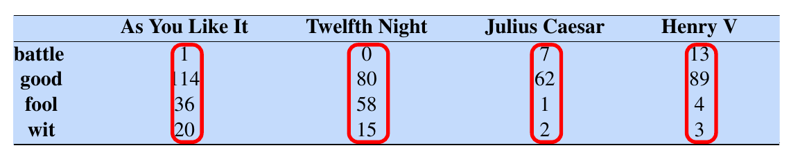{#fig-term-doc-jm width=70%}

If we intend to represent each document as a numeric vector, the columns,
highlighted by the red boxes, would be a natural choice. Suppose we only focus
on the coordinates corresponding to the words `battle` and `fool`. Then a
visualisation of the documents would look like @fig-doc-vis-jm.

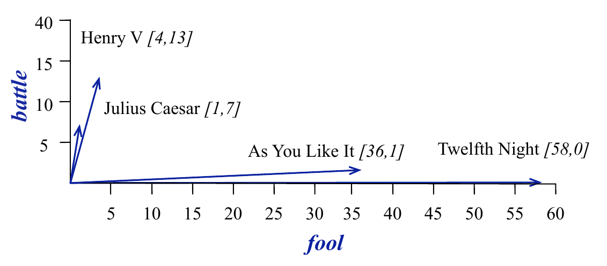{#fig-doc-vis-jm width=70%}

Visually, it is easy to tell that "Henry V" and "Julius Caesar" are similar
(they point in the same direction) as opposed to "As You Like It" and "Twelfth
Night". But it is also easy to see *why* - the former two contain similar high
counts of `battle` compared to the latter two, which are comedies. 

Tf-idf are a normalised version of the above raw counts; they provide a
numerical representation of documents, adjusting for document length and words
that are common across all documents in a corpus.

### Cosine similarity

In order to quantify the similarity (or nearness) of vector representations in
NLP, the common method used is cosine similarity. Suppose that we have a vector
representation of two documents $\mathbf{v}$ and $\mathbf{w}$. If the
vocabulary size is $N$, then each of the vectors is of length $N$. Since we are
dealing with counts the coordinate values of each vector will be non-negative.
We use the angle $\theta$ between the vectors as a measure of their similarity:

$$
\cos \theta = \frac{\sum_{i=1}^N v_i w_i}{\sqrt{\sum_{i=1}^N v_i^2} \sqrt{\sum_{i=1}^N w_i^2}}
$$

Geometrically, cosine similarity measures the size of the angle between vectors (see @fig-cos-sim-jm).

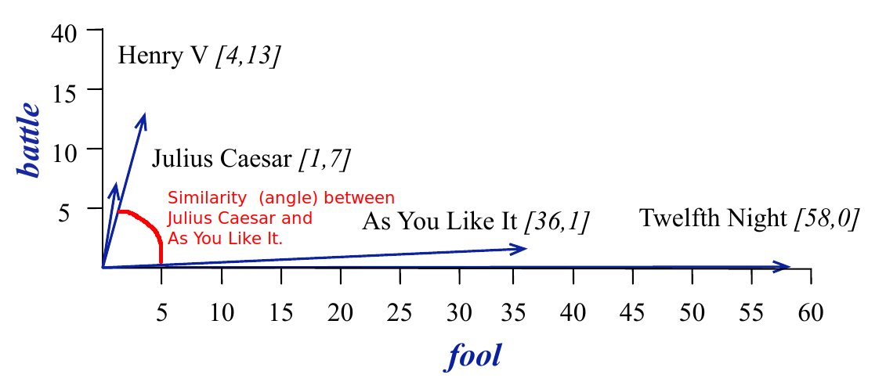{#fig-cos-sim-jm width=70%}

### Dense Embeddings

One of the drawbacks of sparse vectors is that they are very long (the length
of the vocabulary), and most entries in the vector will be 0. As a result,
researchers worked on methods that would pack the information in the vectors
into shorter ones. Instead of working on representations of the documents, the
methods aimed to create representations of each token (or word) in the
vocabulary. These are referred to as *embeddings*.

Here, we shall discuss word2vec (@mikolov2013distributed), but take note that
there are others. GLoVe (@pennington2014glove) was invented soon after, but the
most common embeddings used today arise from Deep Learning models. The most
widely used version is BERT (see the video references below, as well as 
@devlin2019bert).

The approach in word2vec deviates considerably from tf-idf, in that the goal is
to obtain a numeric representation of a word, 
*in the context of it's surrounding words*. Consider this statement:

> 13% of the United States population eats <font color="red">pizza</font> on any given day. Mozzarella is commonly used on
> <font color="red">pizza</font>, with the highest quality mozzarella from Naples. In Italy, <font color="red">pizza</font> served in formal 
> settings is eaten with a fork and knife.

The words `eats`, `served` and `mozzarella` appear close to `pizza`. Hence
another word that appears in similar contexts, should be *similar* to `pizza`.
Examples could be certain baked dishes or even `salad`. 

To achieve such a representation, word2vec runs a self-supervised algorithm,
with two tasks:

1. **Primary task:** To "learn" a numeric vector that represents each word.
2. **Pretext task (stepping stone):** To train a classifier that, when given a word $w$, predicts nearby context words $c$.

Self-supervised algorithms differ from supervised algorithms in that there are
no labels that need to be created. The pre-text task trains a model to perform
predictions, based on a sliding window context (see @fig-cs229-self-sup).

::: {layout-ncol=1}
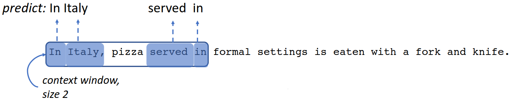{width=70%}

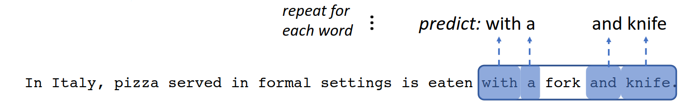{#fig-cs229-self-sup width=70%}
:::


Starting with an initial random vector for each word, the algorithm updates the
vectors as it proceeds through the corpus, finally ending up with an embedding
for each word that reflects its semantic value, based on neighbouring words.

In NLP, the quality of an embedding can be evaluated using an analogy task:

> Given X, Y and Z, find W such that W is related to to Z in the same way that X is related to Y.

For instance, if we are given the pair `man`:`king`, and the word `woman`, then
the embedding should return `queen`, since `woman`:`queen` in the same way that
`man` is related to `king`. Geometrically, the answer to the analogy is
obtained by adding (king - man) to woman. The nearest embedding to the result,
is returned as the answer.

On the left are examples of the types of analogy pairs that word2vec is able to
solve, while on the right, we have visualisations of GLoVe.


::: {layout-ncol=2}

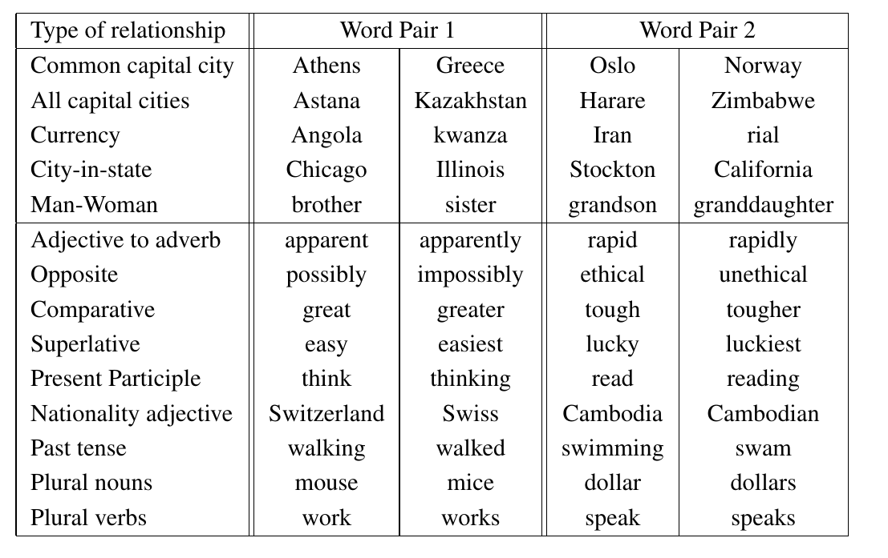{width=70%}

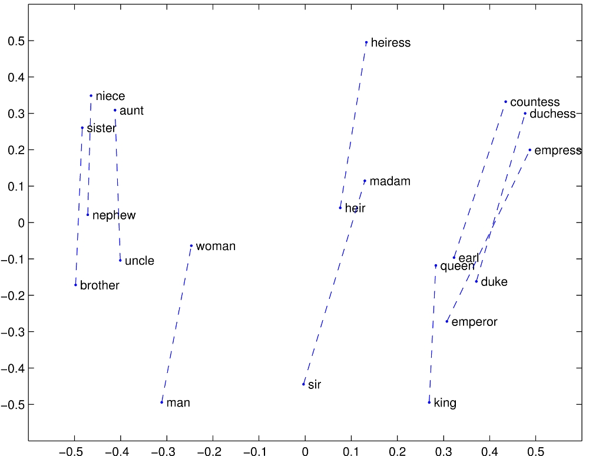{width=70%}
:::

::: {#exm-glove-01 style="background-color: #D5D1D164; padding: 20px"}

### Glove dense embeddings

Here's how we can use `gensim` code to conduct the analogy task. First, we load
400,000 GLoVe vectors, each representing a different word. Each vector is of
length 300. We load the vectors from Hugging Face, just like we will later in 
@sec-nlp-applications.

```{python}
hf_token = os.environ.get('HF_TOKEN')
word_vectors = StaticVectors("neuml/glove-6B")
```

The `word_vectors` object can be used to return GloVe embeddings for tokens. For
instance, `word_vectors.embeddings('woman')` will return the numpy array
corresponding to "woman".

The following code will create a `NearestNeighbors` object, that allows us to 
retrieve the nearest vector(s) to a given one. 

```{python}
nbrs = NearestNeighbors(n_neighbors=5, 
                        metric='cosine', algorithm='auto').fit(word_vectors.vectors)
```

The following code will run the analogy task. It returns the answer to:

> Man is to king as woman is to ______ .

```{python}
nlp.word_analogy(word_vectors, nbrs, 'man', 'king', 'woman')
#word_analogy(word_vectors, nbrs, 'switzerland', 'swiss', 'cambodia')
```

:::

## Visualisation with t-SNE {#sec-04-t-SNE}

When compared with sparse embeddings, dense embeddings are compact. However, a
more important difference is that dense vectors contain the semantic meaning
of words. This means that vectors that are close to each other are similar
in meaning. Let us use t-SNE to visualise the GloVe embeddings.

There are a total of 400,000 vectors in the embedding. Even with t-SNE that will
be difficult to make sense of. Hence for now, we simply visualise the first 1000
most common words.

The following code extracts the first 1000 word vectors and applies the t-SNE 
transformation to them. Please refer to @sec-03-t-SNE for more details.

```{python}
nn = 1000
glove_1e3 = word_vectors.vectors[:nn, :]
labels = pd.Series(list(word_vectors.tokens.keys())[:nn])

tsne1 = manifold.TSNE(n_components=2, init="random", perplexity=10, 
                      metric='cosine', verbose=0, max_iter=5000, 
                      random_state=222)
glove_transformed = tsne1.fit_transform(glove_1e3)

df2 = pd.DataFrame(glove_transformed, columns=['x','y'])
df2['labels'] = labels
```

You should get the same plot (@fig-tsne-glove) as us since we have set the same
seed at the start of the cell, and when we initialise the transformer. Explore
the resulting plot - notice how months of the year appear close together at the bottom left.
Around the left as well, the calendar years appear as a group.

::: {.content-visible when-format="html"}

```{python}
#| fig-align: center
fig = px.scatter(df2, x='x', y='y', text='labels', width=1024, height=960)
fig.update_traces(textposition='top center')
fig.show()
```

:::

::: {.content-visible when-format="pdf"}

Please refer to the online version of the text for an interactive plot, with 
text labels.

```{python}
#| fig-align: center
#| fig-cap: t-SNE plot of GloVe embedding
#| label: fig-tsne-glove
#| fig-pos: 'ht'

plt.figure(figsize=(8, 4))
sns.scatterplot(data=df2, x="x", y="y")
```
:::

::: {.callout-note}

Would we be able to make such a plot using tf-idf? Why or why not?

:::

## Neural Language Models

Language is complex. It is incredible how we can understand such long paragraphs
of texts with such ease. We somehow seem to have learnt complicated sets of
grammar and syntax just by listening to others speak. To get a machine to learn
language has not been easy. It is only recently that Large Language Models such
as chatGPT have demonstrated that it is possible for machines to converse with
humans just as we do to one another.

Neural Models (or deep learning models) have been the key to this. In this
subsection, we provide a very brief overview of their characteristics that
allow them to achieve impressive performance on a range of language-related
tasks.

The basic unit of a neural model is the neural unit (@fig-neural-unit). It consists
of weights and a non-linear activation function. Given an input vector, the
weights are multiplied by the input vector, summed and then fed through the
activation function to generate an output.

::: {layout-ncol=2}
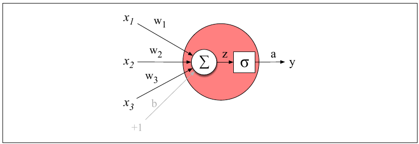{#fig-neural-unit width=70%}

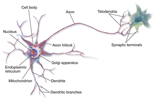{width=70%}
:::

Neural models are made up of many neural units, organised into layers. The first
neural models were Feed-Forward Networks. Due to the virtue of being able to
incorporate many parameters, and due to semi-supervised learning, they were
already a huge improvement over earlier models. @fig-ffn shows a simple set up,
with one hidden layer for training a language model (used to predict the next
word, from the preceding three). It can also be used to learn embeddings.

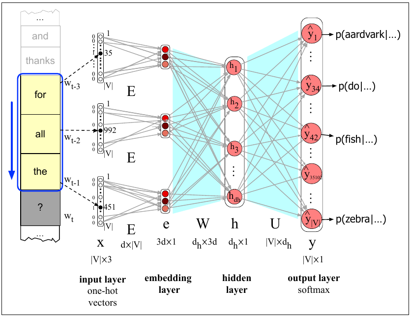{#fig-ffn width=70%}

The next evolution in neural models was the ability to incorporate words in the
recent history. For humans, this comes naturally. For instance, we know that
this is grammatically correct:

> The flights the airline was cancelling **were** full.

For neural models to have this ability, it was necessary to incorporate the
hidden layers from recent words when processing the current word. Recurrent
Neural Networks (RNNs) and Long-Short Term Memory (LSTM) networks had these
features, but they were very slow to train. The major breakthrough came with the
invention of the transformer architecture. The self-attention layer of these
networks gave a word access to *all* preceding words in the training window,
instead of just one (see @fig-basic-transformer). Most importantly. the training
of these networks could be parallelised!

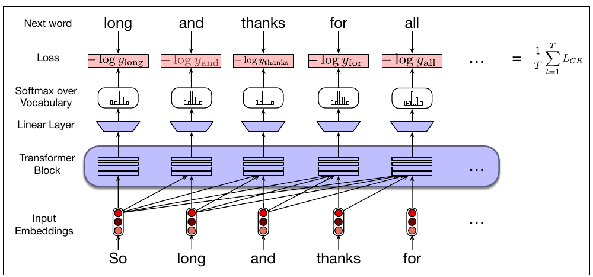{#fig-basic-transformer width=70%}

Here are some more examples where transformers excel:

> The keys to the cabinet *are* on the table.
> 
> The chicken crossed the road because *it* wanted to get to the other side.
> 
> I walked along the pond, and noticed that one of the trees along the *bank*
> had fallen into the water after the storm.

In the final sentence, the word `bank` has two meanings - how will a model know
to decide the correct one? With transformers, because the full context of a word
is captured along with it, it is possible to perform this disambiguation. In
@fig-disambig, we can see that almost every word has multiple meanings. But with
context, the correct meaning can be identified.

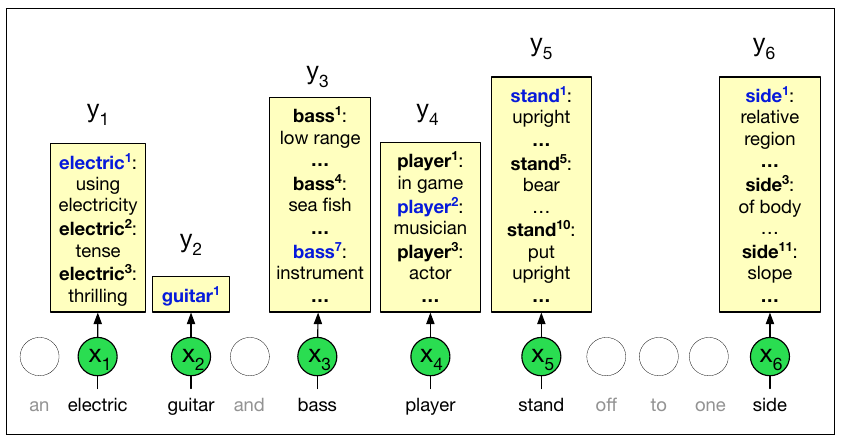{#fig-disambig width=80%}

## Applications {#sec-nlp-applications}

[Hugging Face](https://huggingface.co/) has spent a considerable effort to make
Neural Language Models accessible and available to all with minimal coding. For
starters, they have ensured that all their models are described in a
standardised manner with model cards. Here is an example of a 
[model card for BERT](https://huggingface.co/google-bert/bert-base-uncased).

Moreover, they have developed easy to use pipelines. For NLP, the following
tasks have mature pipelines:

* Feature-extraction (obtaining the embedding of a text)
* Named Entity Recognition
* Question-answering
* Sentiment-analysis
* Summarization
* Text-generation
* Translation, and
* Zero-shot-classification.
  
### Sentiment Analysis

In this subsection, we shall utilise one of their sentiment analysis models on
the wine reviews dataset. This is a transformer-based neural language model
(BERT) that has been fine-tuned with data labelled with sentiments. All we have
to do is feed in the sentence, and we will obtain a confidence score, and a
sentiment label.

```{python}
classifier = pipeline("sentiment-analysis", 
  model="distilbert/distilbert-base-uncased-finetuned-sst-2-english")
  
classifier(["I love this course!", "I absolutely detest this course."])
```

::: {#exm-wine-reviews-3 style="background-color: #D5D1D164; padding: 20px"}

### Wine reviews sentiments
\index{Wine Reviews!Sentiment Analysis}

The number of reviews we have is close to 120,000. Hence, computing the
sentiments for each and every one will take a long time. Instead, we shall
compute the sentiments for a sample (of size 20, where possible) from each
variety of wine.

The following snippet samples 20 reviews from each wine type.

```{python}
tmp_df = wine_reviews.head(0).copy()

for x,vv in wine_reviews.groupby(wine_reviews.variety):
    grp_len = vv.shape[0]
    if(grp_len >= 20):
        vv = vv.sample(n=20, random_state=99)
    tmp_df = pd.concat([tmp_df, vv], ignore_index=True)
    
review_list = list(tmp_df.description)
```

The next snippet computes the sentiment scores for those sampled reviews, and 
uses a widget to keep track of progress of the iterations.

```{python}
tmp_df['score'] = 0.00
tmp_df['label'] = ''

for i, rr in tqdm(enumerate(review_list), total=len(review_list), desc="Classifying reviews"):
    tmp = classifier(rr)[0]
    tmp_df.loc[i, 'score'] = tmp['score']
    tmp_df.loc[i, 'label'] = tmp['label']
```

Finally, we tabulate the sentiment classifications for the wine types.

```{python}
sent_counts = pd.crosstab(tmp_df.variety, tmp_df.label, margins=True)
sent_counts['proportion'] = sent_counts.POSITIVE/sent_counts.All
```

::: {.content-visible when-format="html"}

```{python}
show(sent_counts)
```

:::

::: {.content-visible when-format="pdf"}

```{python}
sent_counts.head()
```

:::

These are the reviews for one of the varieties that had a proportion of positive
reviews close to 50%.

```{python}
for x in wine_reviews[wine_reviews.variety == 'Tempranillo Blanco'].description.values:
    pp.pprint(x) 
```

The corresponding labels from the classifer are :

```{python}
tmp_df[tmp_df.variety == 'Tempranillo Blanco'][['description', 'label']]
```

:::

::: {.callout-note}
Do you agree with the classifications above? What would you investigate next?
:::

### Information Retrieval

In the NLP context, Information Retrieval (IR) refers to the task of returning
the most relevant set of documents, when given a query string. Search engines,
e.g. Google, are trained to perform fast and accurate IR. Typically, a long
list of documents is returned, with the most relevant one on top.

::: {.callout-note}
Pause for a moment, and consider how you would assess the performance of such a
search engine.
:::

::: {#exm-wine-reviews-2 style="background-color: #D5D1D164; padding: 20px"}

### Wine reviews information retrieval
\index{Wine Reviews!Information retrieval}

A simple way to perform IR is to use cosine similarity to compute how close the
given query vector is to the individual documents in the corpus.

The next snippet initialises a `NearestNeighbors` model for retrieving similar documents.

```{python}
# IR retrieval use-case:
wine_tfidf = TfidfVectorizer(stop_words='english')
X2 = wine_tfidf.fit_transform(wine_reviews.description)

wine_nbrs = NearestNeighbors(n_neighbors=10, metric='cosine', algorithm='auto').fit(X2)
```

Next, we retrieve the most relevant reviews for the query: "acidic white chardonnay".

```{python}
awc = wine_tfidf.transform(['acidic white chardonnay'])
distances, indices = wine_nbrs.kneighbors(awc, n_neighbors=8)
for x in indices[0]:
    pp.pprint(all_review_strings[x]) 
```

:::

::: {.callout-note}
Try your favourite tastes, see if you discover a wine you like/dislike 🍷🍇🥂
:::

### Topic Modeling

The LDA (Latent Dirichlet Allocation) model assumes the following intuitive
generative process for the documents:

1. There is a set of $K$ topics that the documents come from. Each document
   contains words from several topics. There is a probability mass function on the
   topics for each document.
2. For each topic, there is a probability mass function for the distribution of
   words in that topic. 

At the end of LDA topic modeling, we will be able to tell, for a particular (new
or old) document: the weight combination of the topics for that document. For
each topic, we would be able to tell the terms that are salient. LDA only gives
us the probabilistic weights - we have to interpret them ourselves.

::: {#exm-wine-reviews-lda style="background-color: #D5D1D164; padding: 20px"}

### Wine reviews topic modeling
\index{Wine Reviews!Topic modeling}

Suppose we decide to split the corpus into 5 topics. Let us investigate what
these topics consist of. First, we add words that are specific to wine reviews,
but common to different topics, to our list of stop words.

```{python}
en_stop_words = en_stop_words + ["flavors", "years", "wine", "drink", "fruits", 
                                 "fruit", "finish", "aromas", "palate", "feels", 
                                 "notes", "oak", "offers", "like", "bottling", 
                                 "nose", "shows"]

# Step 3: Train LDA model
lda_obj = LatentDirichletAllocation(
    n_components=5,           # Number of topics
    random_state=41,
    max_iter=20,
    learning_method='batch',
    evaluate_every=-1, verbose=0, n_jobs=2
)

wine_tfidf = TfidfVectorizer(stop_words=en_stop_words)
X2 = wine_tfidf.fit_transform(wine_reviews.description)
lda_obj.fit(X2);
```

The output object provides the most common terms that define each topic
(remember: each topic is defined as a *probability distribution over the vocabulary*).

The following code snippet will print the 10 most common words from each topic:

```{python}
feature_names = wine_tfidf.get_feature_names_out()

n_top = 10
rows = []
for i, topic in enumerate(lda_obj.components_):
    top_words = [feature_names[j.item()] for j in topic.argsort()[-n_top:][::-1]]
    rows.append(top_words)

[','.join(x) for x in rows]
```

:::

This is the point where human interpretation and domain knowledge enters the fray. 
We could interpret the five topics as follows:

* Topic 0: Discussion about bold red wines, with with dark fruit and tannins. 
* Topic 1: Wines defined by their acidity and structure — likely medium-bodied reds 
  or fuller whites with some oak influence. Focus is on balance and mouthfeel.
* Topic 2: Sweet white wines, Chardonnay-focused — aromatic whites with fruit, 
  sweetness, and vanilla notes.
* Topic 3: Lighter-bodied wines with both red fruit and citrus/herbal notes. These 
  could cover lighter reds or dry whites. The variety of fruit types suggests a 
  more generic/mixed category.
* Topic 4: Red wines with spice and pepper character. Shares some vocabulary with 
  Topic 0.

A delightful visualisation from `pyLDAvis` allows us to understand the
"distance" between topics, and the frequent words from each topic easily. To
generate the visualisation in your notebook, execute the following command. By
default, `pyLDAvis` tries to install `gensim`, but that clashes with `scipy`.
Hence I did not include `pyLDAvis` in `requirements.txt`. Instead, install it
manually with this command in a Jupyter notebook cell:

```{python}
#| eval: false
%pip install --no-deps pyLDAvis
```

Once installed, run the visualisation with the follwing snippet:

```{python}
#| eval: false
import pyLDAvis
import pyLDAvis.lda_model as lda_model

vis = lda_model.prepare(lda_obj, X2, wine_tfidf)
pyLDAvis.display(vis)
```

The online version of our textbook contains the interactive version.

::: {.content-visible when-format="html"}

* [Interactive visualisation](04-nlp_ldavis.html)

:::

::: {.content-visible when-format="pdf"}
Here is a static version for the pdf textbook:

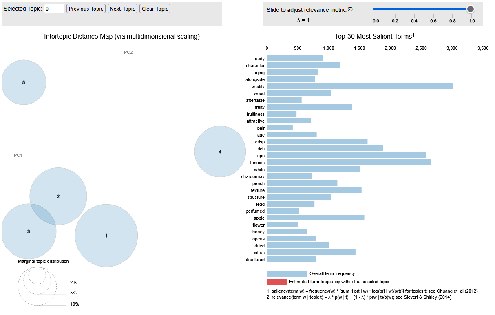{align="center"}
:::

A couple of things to note:

1. The numbering of topics in the paragraph above does not match the 
   numbers within the circles of the visualisation. For easy mapping, we have the
   following mapping of text topics to visual circles:
   * 0 -> 1, 1 -> 4, 2 -> 5, 3 -> 2, 4 -> 3.
2. The circles in the visualisation represent the topics. The distance between
   circles is the distance between the topic distributions, projected onto $R^2$ 
   using MDS. From the visual, we can see that topics 2 and 3 are similar, and
   they are similar to topic 1. However topics 4 and 5 are different from each other,
   and from the group 1, 2, and 3.
   
## Interpretation of Neural Models

Neural models have achieved impressive performance on a number of
language-related tasks. However, one criticism of them is that they are
"black-box" models; we do not fully grasp how they work. This can lead to a
mistrust of such models, with good reason. If we do not fully know how these
models work, we would not know when they are might fail, or we might not know
the reason when they do fail (or make an incorrect prediction). For this reason,
a huge amount of research effort is currently directed towards understanding and
interpreting neural models.

One approach is to identify which examples in the training set were most
influential for predictions regarding particular test instances. For incorrect
predictions, this could give us intuition on why the model is failing, and guide
us to ways to fix it. @fig-black-box depicts an example where it was possible to
pinpoint why a model yielded incorrect sentiment prediction.

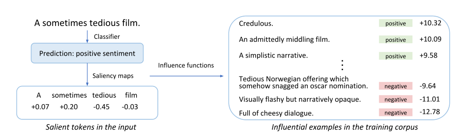{#fig-black-box width=75%}

In the example shown in @fig-black-box, the statement "A sometimes tedious film"
has been wrongly classified as having a "positive" sentiment. To understand why
this happened, training instances are removed one at a time; those that result
in the greatest change in the prediction are deemed to be influential points.
These are shown on the right side of the diagram. The presence of multiple 
ambivalent statements that were labelled as "positive" makes it easier to 
understand why the mistake happened.

Another approach is to identify which parts of the test sentence itself were
important to the eventual prediction. Imagine perturbing the test sentence in
some ways, and studying how the prediction changed. In one study of a
Question-Answering model (see @fig-infl-test-cases), the question was modified
by dropping the least important word, until the question was answered
incorrectly. This gives us an indication of which words were vital for the
question to be answered correctly. In this case, the study revealed something
pathological about the model. A one-word question seemed to still provide the 
correct answer from this passage!

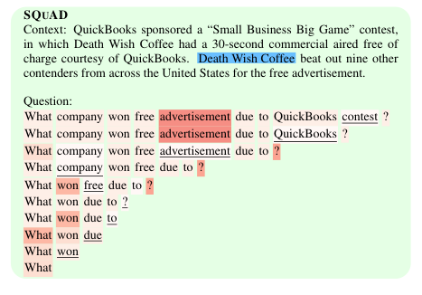{width=75% #fig-infl-test-cases}

For transformers in particular, a great deal of study has focused on the
weights that the attention layers pick up. By relating these to linguistic
information, researchers try to infer the precise language-related information
that models retain. For instance, it has been found that BERT learns parts of
speech. It is also able to identify the dependencies between words. In @fig-bert-dep, 
we can conclude that the prepositions place great attention on their objects, e.g. 
*of* on *Treasury* and *bonds*, and *in* on *trading*, and so on.

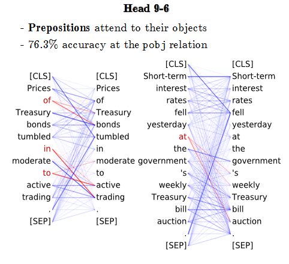{width=75% #fig-bert-dep}

## References

### Video explainers

1. [Transformer models and BERT](https://www.youtube.com/watch?v=t45S_MwAcOw): A very good video from Google Cloud Tech on current neural models (11:37)
2. [Introduction to RNN](https://www.youtube.com/watch?v=UNmqTiOnRfg)
3. [Introduction to BERT](https://www.youtube.com/watch?v=ioGry-89gqE)


### Website References

1. [Hugging Face course on transformers](https://huggingface.co/learn/nlp-course/chapter1/1)
2. [Gensim documentation](https://radimrehurek.com/gensim/auto_examples/index.html): Contains tutorials as well.
3. [Using sklearn to perform LDA](https://scikit-learn.org/stable/modules/generated/sklearn.decomposition.LatentDirichletAllocation.html): We can also use scikit-learn
   to perform LDA.
4. [Visualising LDA](https://github.com/bmabey/pyLDAvis): Contains sample notebooks for the visualisation.
