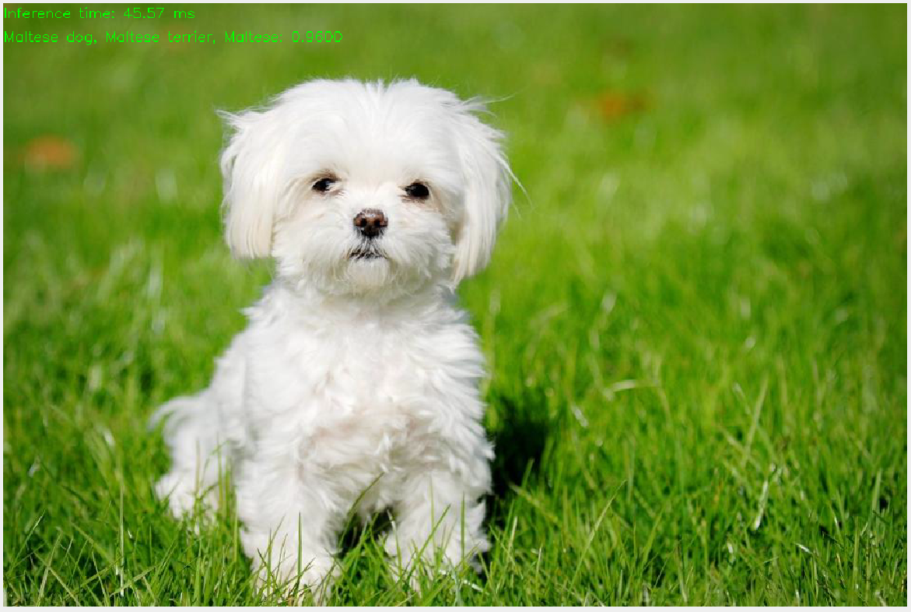

## Introduction

Data science has a number of applications in computer vision. These have
increased in number and accuray in the past 5 years or so due to the
advancements in deep learning (both theory and computational feasibility). In
this topic, we shall experiment with some of the applications, utilising
existing deep learning models.

Here is a short list of applications of computer vision techniques:

1. Optical Character Recognition: Reading handwritten documents, car license
   plate numbers from images.  
2. Surveillance and traffic monitoring: Monitoring cars on a highway, tracking
   humans in security cameras for suspicious activity.
3. Machine inspection: Automatically detecting damage on components
   manufactured, such as silicon wafers, etc.

[Here](https://www.cs.ubc.ca/~lowe/vision.html) is an old page with a more
comprehensive list of applications.

In computer vision, the goal is to get a computer to perceive the world as *we*
see it. This is not easy even for us humans to do - we can get fooled by
optical illusions such as the ones below. In general though, for us, it is
possible to do things like pick out faces that we recognise from a photograph
of a crowd. But how can we get a computer to do it? 

In this chapter, we shall begin with techniques for processing images. Although
computer vision models are impressive, their performance can be typically be
improved greatly by pre-processing images before applying the ready-to-use
models. Toward the end of the chapter, we shall demonstrate how to call various
models.

```{python}
import cv2
import sys
import numpy as np
import os

import matplotlib.pyplot as plt
from matplotlib import colormaps
from IPython.display import YouTubeVideo, display, HTML, Image, Video
```

## Image Processing

### Reading Images

The `opencv` package contains routines for reading images into Python. Images
are typically represented using the RGB colorspace. Each image is a (W x H x 3)
numpy array. Each layer corresponds to one of these channels. However, opencv
uses the order BGR. When you use `plt.imshow` to plot an image that has been
read in using opencv, take note of this, as it might not appear "correct".

::: {#exm-starry-night-1 style="background-color: #D5D1D164; padding: 20px"}
### Reading in the Starry Night image
\index{The Starry Night!Reading}

Consider the painting *The Starry Night*. The original colours are shown in 
@fig-starry-night-orig.

```{python}
#| fig-align: center
#| fig-cap: "Starry Night original colours"
#| label: fig-starry-night-orig
#| fig-pos: 'ht'
#| echo: false

Image("data/starry_night.jpg", width=240)
```

However, if we use `cv2` to read the image before displaying, the colours will
be reversed (see @fig-starry-night-cv2).


```{python}
#| fig-align: center
#| fig-cap: "Starry Night reversed colour channels"
#| label: fig-starry-night-cv2
#| fig-pos: 'ht'

starry_night = cv2.imread('data/starry_night.jpg')
# Reversed (not correct)
plt.imshow(starry_night);
```

:::

::: {.callout-note}

Instead of reading the image file with `cv2` and then using `matplotlib`, we
can display the image with `cv2` as well. The following code should open up
The Starry Night image in a new window on your computer. Press `q` to close the
window.

```{python}
#| eval: false

# plotting with cv2.imshow returns the correct colours.
# Hit any key on the keyboard to close window (do not hit the "X" button)

cv2.imshow('Starry Night', starry_night)
cv2.waitKey()
cv2.destroyWindow('Starry Night')
```

Ensure that the above works for you, because we are going to be using this
approach (instead of matplotlib) to display the capture from your laptop camera
in the later sections of this chapter.
:::

### Image Transformations

Computer vision models can be sensitive to lighting, angle of capture, and to
extraneous objects in the image. Hence it is best to process the image before
applying the model; this will typically result in more reliable performance. In
this subsection, we demonstrate a few common image processing steps.


::: {#exm-starry-night-2 style="background-color: #D5D1D164; padding: 20px"}
### Common image transformations
\index{The Starry Night!Transformations}

We are going to apply four common transformations to the Starry Night image:

1.  First, we are going to convert the colorspace to grayscale. Several
    computer vision techniques work only on grayscale images, so this is a common
    step to be aware of. Take note that grayscale images are numpy arrays with
    shape $R \times C$, whereas RGB/BGR images are stored as arrays with shape 
    $R \times C \times 3$.

```{python}
# create grayscale version of image
sn_grayscale = cv2.cvtColor(starry_night, cv2.COLOR_BGR2GRAY)
```

2.  Second, we shall demonstrate how to translate an image. In the code for
    this procedure, take note that the origin (ie. the (0,0) coordinate) is at the 
    top-left corner. The x-values increase to the right from there until the
    number of columns; y-values increase downward from there until the number
    of rows.

```{python}
rows,cols = starry_night.shape[:2]

# Create RGB version of translated image, moved 400 pixels to the right, and
# 100 pixels down. The translation matrix must be of the form:
# [ [1, 0, x-distance],
#   [0, 1, y-distance]]
M = np.float32([[1, 0, 400],[0, 1, 100]]) # Translation matrix
sn_translate = cv2.warpAffine(starry_night, M, (cols, rows))
sn_translate_rgb = cv2.cvtColor(sn_translate, cv2.COLOR_BGR2RGB)
```

3.  The third code snippet demonstrates how to rotate an image. For this, and
    the previous step, we require a transformation matrix, that we then apply 
    to the image using `cv2.warpAffine`.

```{python}
# Create RGB version of image, rotated 30 degrees anti-clockwise, about it's 
# centre.
rotation_matrix = cv2.getRotationMatrix2D((0.5*cols, 0.5*rows), 30, 1)
sn_rotated = cv2.warpAffine(starry_night, rotation_matrix, (cols, rows))
sn_rotated_rgb = cv2.cvtColor(sn_rotated, cv2.COLOR_BGR2RGB)
```

4.  Finally, we show how an image can be resized (scaled up or down) using 
    `opencv`. When an image is made larger, the pixels need to be interpolated 
    to fill up the gaps; this can be done using a linear or cubic
    interpolation.

```{python}
# Resize the image by 20% in each direction, with cubic interpolation.
sn_resized = cv2.resize(starry_night, None,fx=1.2, fy=1.2, 
                        interpolation = cv2.INTER_CUBIC)
sn_resized_rgb = cv2.cvtColor(sn_resized, cv2.COLOR_BGR2RGB)
# Uncomment this line to save the new image and compare with the original.
# cv2.imwrite('data/test_sn.jpg', sn_resized)
```

Figure @fig-starry-night-transformations displays the four transformed images
using `matplotlib`. Take note of the axes dimensions for the resized image;
although the displayed image appears to be the same size as the others, it is
not, due to the resizing.

```{python}
#| fig-align: center
#| fig-cap: "Image transformations"
#| label: fig-starry-night-transformations
#| fig-pos: 'ht'
#| echo: false

images = [sn_grayscale, sn_rotated_rgb, sn_translate_rgb, sn_resized_rgb]
titles = ['Grayscale', 'Rotated 30 degrees', 'Translated', 'Resized']

fig, axes = plt.subplots(2, 2, figsize=(10, 8))

for ax, img, title in zip(axes.flat, images, titles):
    if title == 'Grayscale': 
        ax.imshow(img, cmap='gray') 
    else: 
        ax.imshow(img) 
    ax.set_title(title) 

plt.tight_layout() 
```
:::

<br/>

There are several other image processing steps that can be very helpful to know
about. These include
[smoothing](https://docs.opencv.org/4.13.0/d4/d13/tutorial_py_filtering.html), 
[thresholding](https://docs.opencv.org/4.13.0/d7/d4d/tutorial_py_thresholding.html), and 
[morphological operations](https://docs.opencv.org/4.13.0/d9/d61/tutorial_py_morphological_ops.html) such 
as erosion, dilation, opening and closing. Please refer to linked pages on the
opencv documentation website for examples and details.

### Working with Masks

When working in a computer vision project, we often need to extract parts of
the image to work with, or to modify. This is typically done using masks. Masks
are black-and-white images that identify the foreground (white) and the
background (black). This is also sometimes referred to as binary thresholding.

Let us work with the following image of Lionel Messi (@fig-messi-orig), and see
how we can use masks and colour selection to outline the ball.

```{python}
#| fig-align: center
#| fig-cap: "Lionel Messi, footballer."
#| label: fig-messi-orig
#| fig-pos: 'ht'
#| echo: false

Image('data/messi5.jpg', width=480)
```

::: {#exm-messi-1 style="background-color: #D5D1D164; padding: 20px"}
### Creating a mask for the football
\index{Lionel Messi!Mask}

After reading the image into Python, we are going to use a colour picker to
identify the colour of the ball. The following website provides a useful tool
for us to upload an image, and isolate the RGB representaion of the colour we
wish to pick out: <https://redketchup.io/color-picker>

Using this website, we learn that the RGB representation we want is $(244, 251, 95)$. 
It should be clear that there is a range of values corresponding to the yellow
of the ball. To accommodate this range, we convert the colour representation to
HSV (Hue-Saturation-Value), using a function from `cv2`.

```{python}
# R=244, G=251, B=95
cv2.cvtColor(np.uint8([[[95, 251, 244 ]]]), cv2.COLOR_BGR2HSV)
```

The resulting tuple corresponds to the HSV representation of the ball's colour.
The first coordinate corresponds to the hue. We use it to set a range of values
to pick up in the image.

```{python}
messi = cv2.imread('data/messi5.jpg')
hsv = cv2.cvtColor(messi, cv2.COLOR_BGR2HSV)

# define range of yellow color in HSV, using H=31, S=158, V=251 as the reference.
lower_yellow = np.array([21,  100, 100])
upper_yellow = np.array([41, 255, 255])
```

The final line of code to create the mask is the following.

```{python}
#| fig-align: center
#| fig-cap: "Mask for football, and other yellow segments."
#| label: fig-messi-mask
#| fig-pos: 'ht'

# Threshold the HSV image to get only blue colors
mask1 = cv2.inRange(hsv, lower_yellow, upper_yellow)
plt.imshow(mask1, cmap='gray');
```

Compare the black-and-white image in @fig-messi-mask with the original one in
@fig-messi-orig. The white regions below correspond to yellow coloured sections
in the original image. The white pixels take the value 255, while the black
pixels are 0. 

Just before we close this example, we are going to modify the numpy array
corresponding to this mask, to encompass the whole ball, not just the yellow
segments.

```{python}
mask1[:, :330] = 0
mask1[:, 405:] = 0
```

:::

<br/>
The next section of code identifies contours around the ball region, computes
the convex hull around these points and then draws this on the original image (see 
@fig-messi-mask-2).

```{python}
#| fig-align: center
#| fig-cap: "Lionel Messi with outline of ball"
#| label: fig-messi-mask-2
#| fig-pos: 'ht'

#im2, contours= cv2.findContours(mask1, cv2.RETR_TREE, cv2.CHAIN_APPROX_SIMPLE)

contours, _ = cv2.findContours(mask1, cv2.RETR_EXTERNAL, cv2.CHAIN_APPROX_SIMPLE)

largest_contour = max(contours, key=cv2.contourArea)
hull = cv2.convexHull(largest_contour)
cv2.drawContours(messi, [hull], -1, (0, 0, 255), thickness=2)

plt.imshow(cv2.cvtColor(messi, cv2.COLOR_BGR2RGB));
```

### Modifying Perspective of Images

There are situations where we need to transform the perspective of an image, in
order to identify objects better, or to perform OCR better. To do so, we need
to provide a map of four points from the original image (in the same plane),
and the corresponding four points in the transformed image. At its heart, this
is still a transformation, just like a rotation or a translation, but the
transformation will not preserve lengths and angles. Here are a couple of
examples. 

::: {#exm-sudoku-1 style="background-color: #D5D1D164; padding: 20px"}
### Sudoku perspective transform
\index{Sudoku!Perspective}

Here is an example of transforming the perspective of a sudoku board from a
newspaper. The coordinates that result in the red quadrilateral in
@fig-sudoku-orig were obtained by manual inspection; this process typically
requires a little trial and error.

```{python}
#| fig-align: center
#| fig-cap: "Sudoku reference points"
#| label: fig-sudoku-orig
#| fig-pos: 'ht'

sudoku = cv2.imread('data/sudoku.png')

# Coordinates of original reference points
pts1 = np.float32([[73,85], [350, 88], [355, 360], [48, 357]])

# Create a polygon (clockwise) from reference points.
pts = np.array(pts1, np.int32)
img2 = cv2.polylines(sudoku, [pts], True, (255, 0, 0), 2 )
plt.imshow(img2);
```

The critical functions are `cv2.getPerspectiveTransform` and
`cv2.warpPerspective`. The output of the transformed figure is shown on the
right of @fig-sudoku-warped. It would be much easier to perform OCR on the
figure on the right.

```{python}
#| fig-align: center
#| fig-cap: "Sudoku original and transformed"
#| label: fig-sudoku-warped
#| fig-pos: 'ht'

# destination coordinates of original reference points.
pts2 = np.float32([[0,0],[300,0],[300,300],[0,300]])
M = cv2.getPerspectiveTransform(pts1,pts2)
sudoku_dst = cv2.warpPerspective(sudoku ,M,(300,300))
 
plt.subplot(121),plt.imshow(sudoku),plt.title('Input')
plt.subplot(122),plt.imshow(sudoku_dst),plt.title('Output');
```
:::

For our second example, we turn to a screen capture of a football game
telecast. Our goal is to switch the view from that in @fig-football-orig to a
top-down view of the field.

```{python}
#| fig-align: center
#| fig-cap: "Football match screen capture"
#| label: fig-football-orig
#| fig-pos: 'ht'
#| echo: false

Image('data/football1.png', width=360)
```

::: {#exm-football-1 style="background-color: #D5D1D164; padding: 20px"}
### Football screen capture
\index{Football!Perspective}

Once again, it should be emphasised that the coordinates to be chosen require
some trial and error.

```{python}
football1 = cv2.imread('data/football1.png')
pts1 = np.float32([[45,121],[48,238],[206,230], [155,118]])
pts2 = np.float32([[45,100], [45,220], [77,220], [77,100]])

M = cv2.getPerspectiveTransform(pts1,pts2)
dst = cv2.warpPerspective(football1, M, (504, 360))

pts = np.array([[45,121],[48,238],[206,230], [155,119]], np.int32)
pts = pts.reshape((-1,1,2))
img2 = cv2.polylines(football1, [pts], True, (255, 0, 0), 1 )
```

From @fig-football-warped, it should be clear that only the plane of the
*field* is transformed. The crowd in the stands, and even the players on the
field, are in a different 2-D plane, and hence appear distorted.

```{python}
#| fig-align: center
#| fig-cap: "Football match transformed"
#| label: fig-football-warped
#| fig-pos: 'ht'
#| echo: false

fig = plt.figure(figsize=(10, 5)) 
gs = fig.add_gridspec(1, 2, width_ratios=[2, 1]) 

# First subplot
ax1 = fig.add_subplot(gs[0])
ax1.imshow(cv2.cvtColor(img2, cv2.COLOR_BGR2RGB))
ax1.set_title('Original Screen capture')

# Second subplot
ax2 = fig.add_subplot(gs[1])
ax2.imshow(cv2.cvtColor(dst[:300, :200], cv2.COLOR_BGR2RGB))
ax2.set_title('Transformed Image');
```

:::

## Edge Detection

In an image, an edge could refer to a discontinuity in surface colour, surface
depth, surface direction, or illumination (see @fig-edge-examples).

.](figs/edge_examples.png){width=75% #fig-edge-examples}

Almost all edge detection methods rely on computation of the gradient of pixel
values. If there is a contiguous sharp change along a line, it is indicative of
an edge. 

::: {#exm-sudoku-2 style="background-color: #D5D1D164; padding: 20px"}
### Sudoku edge detection
\index{Sudoku!Edge detection}

The Sobel edge detection technique is one of the most straigtforward to
understand. It can be used to detect vertical or horizontal edges. Let us apply
this technique to the perspective-transformed Sudoku image from @exm-sudoku-1.

Edge detection is almost always performed on the grayscale version of an image.
In the code segment below, `sobelx` and `sobely` now contain the vertical (in
the `x`-direction) and the horizontal (in the `y`-direction) edges.

```{python}
dst_gray = cv2.cvtColor(sudoku_dst, cv2.COLOR_BGR2GRAY)
sobelx = cv2.Sobel(dst_gray, cv2.CV_64F, 1, 0,ksize=5)
sobely = cv2.Sobel(dst_gray, cv2.CV_64F, 0, 1,ksize=5)
```

@fig-sudoku-edges displays the resulting edges from the Sobel technique.

```{python}
#| fig-align: center
#| fig-cap: "Sudoku vertical and horizontal edges"
#| label: fig-sudoku-edges
#| fig-pos: 'ht'

plt.subplot(1,2,1),plt.imshow(sobelx, cmap = 'gray')
plt.title('Sobelx: vertical edges'), plt.xticks([]), plt.yticks([])
plt.subplot(1,2,2),plt.imshow(sobely, cmap = 'gray')
plt.title('Sobely: horizontal edges'), plt.xticks([]), plt.yticks([]);
```

:::

Most edges in real-life images are not as perfect as those in a Sudoku table.
The Canny edge detection technique relies on a multi-step approach to identify
edges in any and all directions. Just like the Sobel approach, the Canny edge
detection technique identifies pixels where the gradient changes sharply with
edges. However, in the next step, based on two input parameters provided by the
user, weak edges are dropped, and strong edges are retained. The ones in the
middle are only retained if they are connected to a strong edge. 

::: {#exm-messi-2 style="background-color: #D5D1D164; padding: 20px"}
### Canny edge detection of ball
\index{Lionel Messi!Canny edge}

Earlier in @exm-messi-1, we used the colour of the ball to locate it within the
image. In this example, we are going to use Canny edge detection. First, take a
look at the application of the algorithm to the grayscale version of the image,
in @fig-messi-canny. Play around with the two parameters (150 and 200) to see
the effect on the number of edges produced.

```{python}
#| fig-align: center
#| fig-cap: "Lionel Messi, Canny edge"
#| label: fig-messi-canny
#| fig-pos: 'ht'

messi_gray = cv2.cvtColor(messi, cv2.COLOR_BGR2GRAY)
messi_canny_edge = cv2.Canny(messi_gray, 150, 200)
plt.imshow(messi_canny_edge, cmap='gray')

```

The next step involves the use of Hough transforms. When applied to edges, this
transform can be used to pick out lines that follow any parametric form, e.g.
lines, quadratic curves, ellipses and circles. Since we know the ball is a
circle, we are going to use the Hough transform to pick it out from the edge
map.

```{python}
blurred = cv2.GaussianBlur(messi_gray, (9, 9), 2)

circles = cv2.HoughCircles(blurred, cv2.HOUGH_GRADIENT, dp=1,
                            minDist=50,
                            param1=50,
                            param2=22,      # low threshold to start, 22 works best
                            minRadius=18,
                            maxRadius=38)

print(circles)
```

Three circles have been located in the image! Can you think of contextual
information you can use to rule out the erroneous balls? @fig-messi-hough marks
out all three circles found.

```{python}
#| fig-align: center
#| fig-cap: "Circles detected with Hough transform"
#| label: fig-messi-hough
#| fig-pos: 'ht'

circles_rounded = np.uint16(np.around(circles))
for i, c in enumerate(circles_rounded[0, :]): 
	cv2.circle(messi, (c[0], c[1]), c[2], (0, 255, 0), 2)     # circle 
	cv2.putText(messi, str(i), (c[0], c[1]),                  # label each one 
	            cv2.FONT_HERSHEY_SIMPLEX, 0.6, (255,255,0), 2)

plt.imshow(cv2.cvtColor(messi, cv2.COLOR_BGR2RGB))
plt.title('Detected circles (numbered)');
```

:::

## Computer Vision Demonstrations

Just as we observed there are numerous NLP tasks, the field of computer vision
has made great strides in several tasks. Among them are:

1. Object detection
2. Object classification
3. Object tracking
4. Face detection
5. Pose estimation
6. QR/Bar code detection
7. Text detection/extraction

Almost all the models that perform well in the above tasks are deep learning
models. In the next few sections, we are going to practice running/configuring
some of the above models. Although these models are already trained, it is a
little tricky to find the resources and parameters to get them up and running.

Before beginning, download the following three repositories and unzip them into
the *same folder*:

1. [OpenCV main repository](https://github.com/opencv/opencv)
2. [OpenCV extra repository](https://github.com/opencv/opencv_extra)
3. [OpenCV model zoo repository](https://github.com/opencv/opencv_zoo)

For instance, your folder structure may now be :

````
|-01-lecture.ipynb
|-... other files
|-opencv/
|-opencv_extra/
|-opencv_zoo/
````

1. `opencv`: This repository contains example images and videos, and configuration files
   for several models. It also contains the routines to download models. 
2. `opencv_extra`: This contains more configuration details for the models.
3. `opencv_zoo`: This contains a smaller range of models, along with the model weights.

### Models from OpenCV Repository {#sec-09-opencvmodels}

First, we demonstrate how to download models using the script in `opencv`. Open
up a terminal, activate your virtual environment and navigate into
`opencv/samples/dnn`. 

Next, check inside `models.yml` for the model that you intend to use. The list
of models available are:

| Model Type | Model Name      |
|------------|-----------------|
| Object Detection | opencv_fd |
| Object Detection | yolov8x   |
| Object Detection | yolov8s   |
| Object Detection | yolov8n   |
| Object Detection | yolov8m   |
| Object Detection | yolov8l   |
| Object Detection | yolov5l   |
| Object Detection | yolov4    |
| Object Detection | yolov4-tiny |
| Object Detection | yolov3      |
| Object Detection | tiny-yolo-voc |
| Object Detection | yolov8    |
| Object Detection | ssd_caffe |
| Object Detection | ssd_tf    |
| Object Detection | faster_rcnn_tf |
| Image Classification  | squeezenet |
| Image Classification  | googlenet  |
| Semantic Segmentation | enet       | 
| Semantic Segmentation | fcn8s      |
| Semantic Segmentation | fcnresnet101 |

For this demonstration, we shall aim to download and run the GOOGLENET image
classification model. Run the following command to download the model weights
for GOOGLENET:

```{python}
#| eval: false
python .\download_models.py --save_dir GOOGLENET googlenet
```

Apart from listing all the models available for download, `models.yml` also
contains the precise configuration settings to run this particular model. For
full reference, here is the section corresponding to GOOGLENET:

```{python}
#| eval: false
# Googlenet from https://github.com/BVLC/caffe/tree/master/models/bvlc_googlenet
googlenet:
  load_info:
    url: "http://dl.caffe.berkeleyvision.org/bvlc_googlenet.caffemodel"
    sha1: "405fc5acd08a3bb12de8ee5e23a96bec22f08204"
  model: "bvlc_googlenet.caffemodel"
  config: "bvlc_googlenet.prototxt"
  mean: [104, 117, 123]
  scale: 1.0
  width: 224
  height: 224
  rgb: false
  classes: "classification_classes_ILSVRC2012.txt"
  sample: "classification"
```

The important parameters to take note are:

* `model`: Refers to the file containing the model weights (which we just downloaded)
* `config`: Configuration parameters. This file is usually present in the `opencv_extra`
  repository.  
* `mean, scale, width, height, rgb`: Arguments that need to be included when calling the 
  python script object_detection.py. 
* `sample`: The python script to call, to demonstrate the use of this model.
* `classes`: GOOGLENET is an object classification model. The specified file
  here contains the labels to be used. The file is present in the
  `opencv/samples/data/dnn` directory.

The final step is to call the python script that demonstrates the use of this
model. You may have to modify the paths to the image files to match those on
your laptop, but you should then see the labelled image, similar to 
@fig-googlenet-output.

```{python}
#| eval: false
python classification.py --model GOOGLENET/405fc5acd08a3bb12de8ee5e23a96bec22f08204/bvlc_googlenet.caffemodel \
--config /home/viknesh/NUS/coursesTaught/ind5003-book/opencv_extra/testdata/dnn/bvlc_googlenet.prototxt \
--width 224 --height 224 --classes ../data/dnn/classification_classes_ILSVRC2012.txt \
--mean 104 117 123 --input /home/viknesh/NUS/coursesTaught/ind5003-book/data/cars.jpg
```

{width=65% #fig-googlenet-output}

Utilising the sample models can be a little tricky, because one has to search
for the right files to use, and the precise configuration to use, but it is an
useful step in learning about the capabilities of vision models.

### Models from OpenCV Model Zoo

The openCV model zoo contains model weights that can be used directly. There is
no need for any further downloads. Open up a terminal, activate your virtual
environment, and navigate to the `opencv_zoo/models/face_detection_yunet/`
folder. Then run the following command:

```{python}
#| eval: false
python demo.py 
```

## Summary

Our chapter is a very brief introduction to vision models. I encourage you to
explore the sample models to understand the capabilities and the various tasks
they have been trained for.

In real-life projects, there will undoubtedly be a large amount of
pre-processing required before the models can be applied to each image. While
the initial section of the chapter touches on these steps, you should read up
on the details, and follow-up with the websites to become more adept at image
manipulation and processing with `opencv`.

## References

### Opencv documentation

1. [Python tutorials](https://docs.opencv.org/4.10.0/d6/d00/tutorial_py_root.html)
2. [Changing colour spaces](https://docs.opencv.org/4.10.0/df/d9d/tutorial_py_colorspaces.html)
3. [Background subtraction](https://docs.opencv.org/3.4/d1/dc5/tutorial_background_subtraction.html)
4. [Opencv bootcamp](https://courses.opencv.org/courses/course-v1:OpenCV+Bootcamp+CV0/about): This is a very useful course on opencv techniques. It will also provide you several more notebooks with template code for object tracking, etc.

### Books

A very comprehensive book on vision techniques is by @szeliski2022computer. An online 
version can be found here: [Computer Vision: Applications and Algorithms](https://szeliski.org/Book/)

### Github repositories

1. [opencv](https://github.com/opencv/opencv)
2. [opencv-extra](https://github.com/opencv/opencv_extra)
3. [opencv model zoo](https://github.com/opencv/opencv_zoo)

## Exercises

1.  In @sec-09-opencvmodels, we downloaded and used the GOOGLENET model. Follow the procedure to 
    download and apply the YOLOv4-tiny model to the same image.
2.  Use the VIT (vision transformer tracker) to track one of players in [this video](vids/obj_tracking_data.mp4). 
    The tracker can be found in the opencv model zoo.
3.  Use Canny edge detection, and then a perspective transform, to create
    @fig-sudoku-exercise, starting from the Sudoku image:
 
```{python}
#| fig-align: center
#| fig-cap: "Sudoku exercise"
#| label: fig-sudoku-exercise
#| fig-pos: 'ht'
#| echo: false

sudoku = cv2.imread('data/sudoku.png')
sudoku_gray = cv2.cvtColor(sudoku, cv2.COLOR_BGR2GRAY)
edges = cv2.Canny(sudoku_gray, threshold1=50, threshold2=150, apertureSize=3)

pts1 = np.float32([[70,82], [495, 85], [515, 515], [30, 515]])
pts = np.array(pts1, np.int32)
pts2 = np.float32([[0,0],[400,0],[400,400],[0,400]])
M = cv2.getPerspectiveTransform(pts1,pts2)
sudoku_straight = cv2.warpPerspective(edges,M, (400, 400))
plt.imshow(sudoku_straight, cmap='gray')
```

4.  Rotate The Starry Night image 45 degrees clockwise about the top-left corner of the image. 
    Display the result using matplotlib, ensuring the colours appear correct.
5.  Use the colour picker to isolate the blue regions of Messi's Barcelona jersey. 
