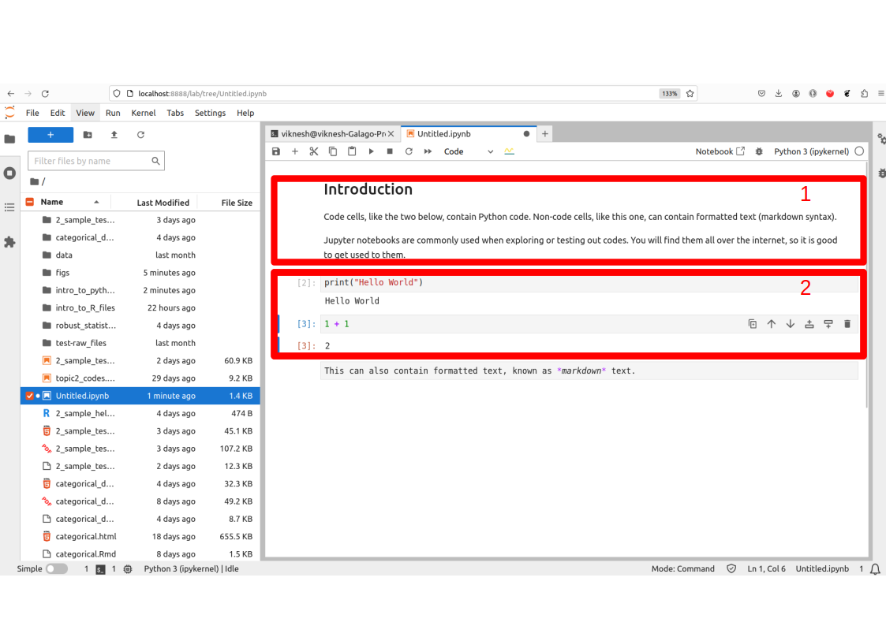
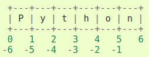

```{python}
#| echo: false
import numpy as np
import pandas as pd
```

## History of Python {.smaller}

* General-purpose, **interpreted** language — no compilation step needed.
* Created in the 1980s by Guido van Rossum at CWI (Netherlands).
  Named after *Monty Python's Flying Circus*.
* Python 3.0 (2008) broke backward-compatibility with Python 2 — always use Python 3.
* Rich ecosystem: `scikit-learn`, `transformers`, `tensorflow` are now
  standard frameworks for data science and ML.

::: {.callout-important}
For our class, please ensure that you are using Python 3.14.
:::

## Setting Up {.smaller}

* **Virtual environments** let you keep multiple Python/package versions on the
  same machine without conflicts.
* Steps (see Canvas videos for your OS):
  1. Download Python from <https://www.python.org/downloads/>
  2. Create a virtual environment for this course.
  3. Install Jupyter Lab inside the environment.

::: {.callout-important}
Even if you are using Anaconda / Spyder / VSCode, you still need a virtual environment.
:::

## Jupyter Lab {.smaller}

{fig-align="center" width=60%}

* **Markdown cells** — formatted text and equations.
* **Code cells** — Python code; run with `Ctrl-Enter`.

## Easter Egg {.smaller}

Every Python installation ships with *The Zen of Python*:

```{python py-easter}
import this
```

## Native Data Structures {.smaller}

Three built-in container types, distinguished by their brackets:

| Type | Brackets | Mutable? |
|------|----------|----------|
| List | `[ ]` | Yes |
| Tuple | `( )` | No |
| Dictionary | `{ }` | Yes |

```{python py-structs}
x_list  = [1, 2, 3]
x_tuple = (1, 2, 3)
x_dict  = {'a': 1, 'b': 2, 'c': 3}
```

## Mutability {.smaller}

* **Mutable** objects (lists, dicts): individual elements can be overwritten.
* **Immutable** objects (tuples, strings): elements cannot be changed in-place.

```{python py-mutable}
x = [1, 3, 5, 7, 8, 9, 10]
x[3] = 17
print(x)
```

```{python py-immutable}
#| eval: false
x_tuple = (1, 3, 5, 6, 8, 9, 10)
x_tuple[3] = 17   # TypeError!
```

## Slice Operator {.smaller}

{fig-align="center" width=50%}

* Python indexes from **0**; negative indices count from the end.
* `obj[a:b]` returns indices `a, a+1, …, b-1` (end-point **excluded**).

```{python py-slice}
char_list = ['P', 'y', 't', 'h', 'o', 'n']
char_list[0]          # first element
```

## For Loops {.smaller}

* Python uses **indentation** (not braces) to define code blocks.
* Lists, tuples, dicts and strings are all **iterables**.

```{python py-forloop}
x = [1, 3, 5, 17, 8, 9, 10]
for i in x[:2]:
    print(f"The current element is {i}.")
```

* f-strings `f"... {variable} ..."` are the recommended way to embed
  values in strings.

## Iterating Dictionaries {.smaller}

```{python py-dict-iter}
dict1 = {'holmes': 'male', 'watson': 'male',
         'hudson': 'female', 'moriarty': 'male', 'adler': 'female'}

for key in dict1.keys():
    print(f"The gender of {key} is {dict1[key]}")
```

## Strings {.smaller}

* `str` is an **immutable** sequence of characters.
* Useful methods: `find`, `replace`, `join`, `lower`, `isupper`, `title` …

```{python py-str-find}
test_str = "Where in the World is Carmen san Diego?"
test_str.find('Carmen')      # returns the position index
```

```{python py-str-replace}
test_str.replace('Carmen', 'John')
```

## String Operations: Join & Iterate {.smaller}

```{python py-str-join}
print("Where shall " "we " "go today?")
# Alternative: ' '.join(["Where", "shall", "we", "go", "today?"])
```

```{python py-str-iter}
count = 0
for x in test_str:
    if x.isupper():
        count += 1
print(f"There were {count} upper-case characters in the sentence.")
```

## Functions {.smaller}

* Use the `def` keyword to define a reusable function.
* The function body is **indented**; no `return` needed for side-effects.

```{python py-fn}
def test_function(x):
    print('You typed', x)

test_function('hello IND5003')
```

## Modules and Packages {.smaller}

* A **module** is a `.py` file with definitions and statements.
* A **package** is a collection of modules.
* Access objects with **dot notation** after importing.

:::: {.columns}

::: {.column width="48%"}

```{python py-mod1}
import math
math.exp(2)
```

:::

::: {.column width="48%"}

```{python py-mod2}
from math import pi
pi
```

:::

::::

## NumPy: ndarray {.smaller}

* Core object: `ndarray` — *n*-dimensional array of **homogeneous** data.
* Key attributes:

| Attribute | Meaning |
|-----------|---------|
| `ndim` | number of axes/dimensions |
| `shape` | length of each axis (tuple) |
| `size` | total number of elements |

```{python np-attrs}
arr = np.array([(1.5, 2, 3), (4, 5, 6)])
print(arr.ndim, arr.shape, arr.size)
```

## Array Creation: Integer Sequences {.smaller}

`np.arange()` creates a sequence with a specified step.

```{python np-arange}
seq = np.arange(0, 10, 3)
seq
```

Note: `shape (4,)` (1-D) $\neq$ `shape (4,1)` (2-D column vector).

```{python np-reshape}
col_vect = seq.reshape(4, 1)
col_vect
```

## Array Creation: Real Sequences & Placeholders {.smaller}

`np.linspace()` creates evenly-spaced **real** numbers.

```{python np-linspace}
arr_real = np.linspace(start=0.2, stop=3.3, num=24).reshape(2, 3, 4)
arr_real
```

```{python np-zeros}
np.zeros((3, 5))         # placeholder; np.ones() also available
```

## Slicing ndarray {.smaller}

* Use **comma-separated** slice notation across axes.
* Omitting an axis returns a complete slice for that dimension.

```{python np-sliceex}
#| eval: false
arr_real[1, 2, 3]
arr_real[0, 2, ::-1]
arr_real[1, 0:3:2]
arr_real[:, 2, :]
```

When printing: last axis → left-to-right, second-last → top-to-bottom.

## Boolean Indexing {.smaller}

Use a boolean array to select elements meeting a condition.

```{python np-bool1}
arr_real > 3
```

```{python np-bool2}
arr_real[arr_real > 3]
```

## Random Numbers {.smaller}

* Use a **seed** (`default_rng(seed)`) for reproducibility across sessions.

```{python np-rng}
rng = np.random.default_rng(1361)
a = rng.uniform(size=(3, 5))
b = rng.uniform(size=(3, 5))
b
```

## Element-wise vs. Matrix Operations {.smaller}

```{python np-ewise}
a + b          # element-wise addition
```

```{python np-emult}
a * b          # element-wise multiplication (NOT matrix mult.)
```

```{python np-matmul}
a.dot(b.T)     # matrix multiplication; equivalent: a @ b.T
```

## Axis-wise Operations {.smaller}

* `axis=0`: collapse **rows** (operate down columns).
* `axis=1`: collapse **columns** (operate across rows).

```{python np-ax0}
arr_real.mean(axis=0)          # shape: (3, 4)
```

```{python np-ax1}
arr_real[0].mean(axis=1)       # row means of first "layer"
```

```{python np-argmax}
arr_real[0].mean(axis=1).argmax()   # index of row with largest mean
```

## Common ndarray Methods {.smaller}

| Method | Example |
|--------|---------|
| `shape` | `arr.shape` |
| `T` | `arr.T` |
| `mean(axis=)` | `arr.mean(axis=0)` |
| `sum(axis=)` | `arr.sum(axis=1)` |
| `argmax(axis=)` | `arr.argmax(axis=0)` |
| `reshape(dims)` | `arr.reshape((5, 1))` |

## Pandas Series {.smaller}

* A **Series** is a 1-D labeled array; labels form the **index**.

```{python pd-series}
year   = pd.Series(list(range(2010, 2013)) * 3)
team   = pd.Series(sorted(["Barcelona", "RealMadrid", "Valencia"] * 3))
wins   = pd.Series([30, 28, 32, 29, 32, 26, 21, 17, 19])
draws  = pd.Series([6, 7, 4, 5, 4, 7, 8, 10, 8])
losses = pd.Series([2, 3, 2, 4, 2, 5, 9, 11, 11])

wins[0:6:2]
```

## Pandas DataFrame {.smaller}

* A **DataFrame** is a 2-D labeled structure; columns can be **different types**.
* Index = row labels (axis 0); columns = column labels (axis 1).

```{python pd-df}
laliga = pd.DataFrame({
    'Year': year, 'Team': team,
    'Wins': wins, 'Draws': draws, 'Losses': losses
})
laliga.head()
```

## Reading Data {.smaller}

```{python pd-read}
happ = pd.read_csv('data/happiness_report.csv', header=0, na_values='NA')
happ.head(3)
```

* `head()`, `tail()` and `info()` are the first things to run on a new dataset.

## Selecting Data {.smaller}

* Select columns by passing a list of names.

```{python pd-sel-col}
happ[['GDP', 'Freedom']].head()
```

::: {.callout-warning}
`happ[0:10, 2:4]` does **not** work — DataFrames are not NumPy arrays.
Use `.loc` / `.iloc` instead.
:::

## .loc and .iloc {.smaller}

:::: {.columns}

::: {.column width="48%"}

`.loc` — **label-based** (end-point **inclusive**):

```{python pd-loc}
happ.loc[2:10:4,
         "GDP":"Generosity":2]
```

:::

::: {.column width="48%"}

`.iloc` — **integer-based** (end-point **exclusive**):

```{python pd-iloc}
happ.iloc[2:11:4, 3:8:2]
```

:::

::::

## Filtering Data {.smaller}

Use a boolean array to retrieve rows satisfying a condition.

```{python pd-filter1}
happiest = happ[happ['Happiness.Score'] > 6.95]
happiest.Country.unique()
```

Combine conditions with `&` (AND) or `|` (OR):

```{python pd-filter2}
happ[(happ.Year == 2015) & (happ['Happiness.Rank'] <= 3)]
```

## Missing Values {.smaller}

* `.info()` reports non-null counts for each column.
* `.dropna()` returns a **new** DataFrame without missing-value rows.

```{python pd-miss}
happ.info()
```

```{python pd-dropna}
new_df = happ.dropna()
new_df.shape
```
