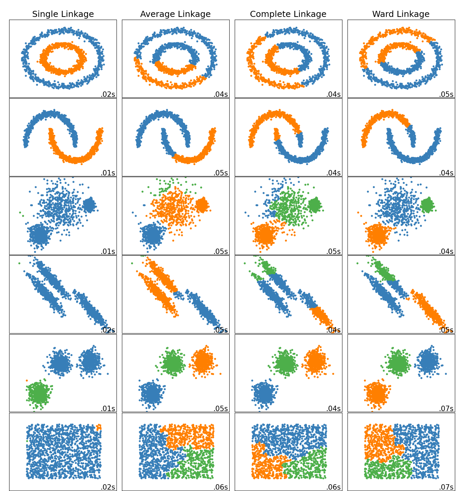

```{python}
#| echo: false
import pandas as pd
import numpy as np
from scipy.cluster import hierarchy
import seaborn as sns
import matplotlib.pyplot as plt
from sklearn import decomposition, preprocessing
from sklearn.metrics import pairwise_distances
from sklearn.manifold import MDS, TSNE
from sklearn.ensemble import IsolationForest
from ind5003 import clust
```

## Unsupervised vs Supervised Learning {.smaller}

* **Supervised**: observations $x_i$ **and** labels $y_i$ — goal is to predict $y$ from $x$.
* **Unsupervised**: only $x_1,\ldots,x_N$, **no labels** — goal is to infer
  properties of the distribution of $X$.

When $p \leq 3$, scatter plots and correlations suffice.
When $p$ is large, we need purpose-built techniques for:

1. **Dimensionality reduction** — compact, uncorrelated representation.
2. **Clustering** — identify natural groups for further study.
3. **Visualisation** — project high-D data to 2-D / 3-D.

## Wine Quality Dataset {.smaller}

11 physicochemical measurements + subjective quality score (0–10).
Two tables (red and white wine) combined.

```{python unsp-wine-load}
wine_red   = pd.read_csv("data/wine+quality/winequality-red.csv",   sep=";")
wine_white = pd.read_csv("data/wine+quality/winequality-white.csv", sep=";")
wine_red['type']   = "red"
wine_white['type'] = "white"
col_names = ['fixed_acidity','volatile_acidity','citric_acid','residual_sugar',
             'chlorides','free_sulfur_dioxide','total_sulfur_dioxide',
             'density','pH','sulphates','alcohol','quality','type']
wine2 = pd.concat([wine_red, wine_white], ignore_index=True)
wine2.columns = col_names
wine2.head(3)
```

## PCA: Formal Setup {.smaller}

PCA yields **principal components** — linear combinations of the original
columns that are uncorrelated with each other:

$$
\mathbf{y}_i = a_{i,1}\mathbf{x}_1 + a_{i,2}\mathbf{x}_2 + \cdots + a_{i,p}\mathbf{x}_p
$$

* We can always extract $p$ components from $p$-dimensional data.
* The first few components typically capture most of the total variance.
* Drop the last few components for a **low-information-loss reduction**.

## PCA: Standardise and Fit {.smaller}

Scale columns to mean 0, variance 1 — prevents variables with large units
from dominating the first component.

```{python unsp-pca-scale}
X_raw    = wine2.iloc[:, :-2]
scaler   = preprocessing.StandardScaler().fit(X_raw)
X_scaled = scaler.transform(X_raw)

pca_full = decomposition.PCA(n_components=11)
pca_full.fit(X_scaled);
```

## PCA: Scree Plot {.smaller}

Look for an **elbow** — the point where extra components add little variance.

```{python unsp-scree}
#| fig-align: center
#| out-width: 65%
PC_vals = np.arange(pca_full.n_components_) + 1
plt.figure(figsize=(5, 2.8))
plt.plot(PC_vals, pca_full.explained_variance_ratio_, 'o-', linewidth=2, color='blue')
plt.title('Scree Plot'); plt.xlabel('PC'); plt.ylabel('Variance Explained');
```

## PCA: Cumulative Variance and Loadings {.smaller}

```{python unsp-cumvar}
pca_full.explained_variance_ratio_.cumsum().round(3)
```

5 components explain ~79.7 % — a good stopping point.

```{python unsp-loadings}
pca = decomposition.PCA(n_components=5)
pca.fit(X_scaled)
loadings = pca.components_.T * np.sqrt(pca.explained_variance_)
lm = pd.DataFrame(loadings, columns=['PC'+str(i+1) for i in range(5)],
                  index=col_names[:-2])
lm2 = lm.copy(); lm2[lm.abs() < 0.3] = 0.0
lm2.round(2)
```

## PCA: Interpreting the Components {.smaller}

Suppress loadings $|a_{i,j}| < 0.3$. Focusing on PC1 and PC2:

* **PC1** — high sugar / sulphur dioxides *vs.* high acidity / chlorides / sulphates.
  White wines tend to score higher here.
* **PC2** — density *vs.* alcohol.

```{python unsp-pca-plot}
#| fig-align: center
#| out-width: 70%
X_tdf = pd.DataFrame(pca.transform(X_scaled),
                     columns=['PC1','PC2','PC3','PC4','PC5'])
X_tdf[['quality','type']] = wine2[['quality','type']]
sns.relplot(data=X_tdf, x='PC1', y='PC2', col='quality', col_wrap=3,
            hue='type', alpha=0.3, height=2.0, aspect=1.1);
```

## Clustering: Dissimilarity Measures {.smaller}

**Goal**: group observations so that within-group observations are similar
and between-group observations are dissimilar.

Common pairwise dissimilarities between $x_i$ and $x_j$:

$$
L_2: \; d = \sqrt{\sum_s (x_{i,s}-x_{j,s})^2} \qquad
L_1: \; d = \sum_s |x_{i,s}-x_{j,s}|
$$

## Linkage Methods {.smaller}

For clusters $G$ and $H$, the **linkage** defines intergroup dissimilarity:

| Method | Rule |
|--------|------|
| Single | closest pair |
| Complete | furthest pair |
| Average | mean of all pairs |
| Ward | minimise within-cluster variance |

{fig-align="center" width=55%}

## Hierarchical Clustering Algorithm {.smaller}

**Agglomerative** (bottom-up):

1. Start: $N$ singleton clusters.
2. Merge the pair with the **smallest intergroup dissimilarity**.
3. Repeat until one cluster remains.

Output: a **dendrogram** — height at each merge reflects the dissimilarity.

```{python unsp-toy-dend}
#| fig-align: center
#| out-width: 45%
X_toy = np.array([[.25,.7],[.3,.8],[.7,.6]])
lm0 = hierarchy.linkage(X_toy)
plt.figure(figsize=(3.5, 2.5))
hierarchy.dendrogram(lm0); plt.title('Toy Dendrogram');
```

## Wine: Dendrogram {.smaller}

```{python unsp-wine-dend}
#| fig-align: center
#| out-width: 80%
hc1 = hierarchy.linkage(X_tdf.iloc[:, :-2], method='ward')
plt.figure(figsize=(10, 3.5))
hierarchy.dendrogram(hc1, p=4, truncate_mode='level');
```

Visually, 2 or 3 groups appear plausible — cut the tree accordingly.

## Silhouette Coefficient {.smaller}

Formally select $K$ using:

$$
S = \frac{b - a}{\max(a, b)}, \quad S \in [-1, 1]
$$

* $a$: mean within-cluster distance (smaller = tighter clusters).
* $b$: mean distance to nearest *other* cluster (larger = better separation).

```{python unsp-silhouette}
clust.compute_silhouette_scores(hc1, X_tdf.iloc[:, :-2], [2, 3, 4])
```

$K=2$ gives the best score for this dataset.

## Wine Clustering: Results {.smaller}

```{python unsp-wine-clust}
#| fig-align: center
#| out-width: 60%
out = hierarchy.cut_tree(hc1, n_clusters=2).ravel()
X_tdf['groups'] = out
sns.relplot(data=X_tdf, x='PC1', y='PC2', col='groups',
            hue='type', alpha=0.3, height=2.5, aspect=1.1);
```

```{python unsp-wine-tab}
wine2.type.groupby(X_tdf.groups).value_counts()
```

The two clusters closely correspond to red vs. white wine.

## Outlier Detection: Isolation Forest {.smaller}

Builds a **forest of random decision trees** by repeatedly:

1. Selecting a random feature and a random split value.
2. Splitting until each observation is isolated.

* **Anomalies** are isolated with **short paths** (they live in sparse regions).
* **Normal** points need many splits (they live in dense regions).
* Average path length over all trees $\Rightarrow$ anomaly score.

`contamination` sets the expected proportion of outliers.

## Taiwan Dataset: Fitting {.smaller}

```{python unsp-isol-fit}
re2 = pd.read_csv("data/taiwan_dataset.csv")
X_re = re2[['trans_date','house_age','dist_MRT',
            'num_stores','Xs','Ys','price']]
X_re_scaled = preprocessing.StandardScaler().fit_transform(X_re)

clf = IsolationForest(max_samples=300, max_features=2,
                      contamination=0.01, random_state=503)
clf.fit(X_re_scaled);

id_outliers = pd.Series(clf.predict(X_re_scaled))
print(id_outliers.value_counts())
```

## Taiwan Dataset: Outlier Properties {.smaller}

```{python unsp-isol-res}
re2['outliers'] = id_outliers
re2[['house_age','dist_MRT','num_stores','price']].groupby(
    re2.outliers).mean().round(2)
```

Outliers ($-1$) show extreme `dist_MRT` and `price` values — investigate
*why* these properties differ from the bulk of the data.

## MDS: Concept {.smaller}

Find map points $z_1,\ldots,z_N \in \mathbb{R}^k$ that preserve the
pairwise dissimilarity matrix of the original high-D data:

$$
S = \left[\sum_{i\ne j}\left(d(x_i,x_j) - \|z_i - z_j\|\right)^2\right]^{1/2}
$$

**MDS vs. PCA:**

* MDS can use **any** dissimilarity (not just Euclidean).
* MDS dimensions are **not** ordered by variance.
* MDS output is **not** a linear combination of the original features.

## Jaccard Dissimilarity {.smaller}

For binary symptom sets $A$ and $B$:

$$
J(A,B) = 1 - \frac{|A \cap B|}{|A \cup B|}
$$

$J=0$: identical; $\;J=1$: no overlap.

```{python unsp-jaccard}
disease = pd.read_csv("data/disease.csv")
disease_names = disease.disease.to_list()
X_d = disease.iloc[:, :-1].to_numpy()
pdist2 = pairwise_distances(X_d != 0, metric='jaccard')
print(f"Dissimilarity matrix: {pdist2.shape}")
```

## Disease Symptoms: MDS Plot {.smaller}

```{python unsp-mds}
#| fig-align: center
#| out-width: 80%
embedding = MDS(n_components=2, normalized_stress='auto', metric='precomputed',
                init='random', n_init=4, random_state=42, max_iter=500, verbose=0)
X_mds = embedding.fit_transform(pdist2)
mds_df = pd.DataFrame(X_mds, columns=['X','Y'])
mds_df['disease'] = disease_names

plt.figure(figsize=(8, 3.5))
ax = sns.scatterplot(data=mds_df, x='X', y='Y', s=20)
for _, r in mds_df.iterrows():
    ax.text(r['X'], r['Y'], r['disease'], ha='center', va='bottom', fontsize=6)
```

## t-SNE: Algorithm {.smaller}

Fast iterative method for **visualising** high-dimensional data:

1. Compute pairwise similarity between *data points* using a **Gaussian** kernel.
2. Iteratively adjust *map points* so their pairwise similarity (via a
   **$t$-distribution**) matches the data-point similarity.

The $t$-distribution (fatter tails) pushes far-apart points further apart in 2-D.

**Key parameters:**

* **Perplexity** — effective number of neighbours; try 5–50.
* **Iterations** — stop when KL-divergence plateaus.

## t-SNE: Caveats {.smaller}

::: {.callout-important}
t-SNE is for **visualisation only** — not for inferring distances or clustering.
:::

1. Inter-cluster distances in map space are **not** meaningful.
2. Only **local** structure is reliably preserved.
3. Always try **multiple perplexity values**.
4. Confirm the algorithm has **converged**.

## Twitter Tweets: Embeddings & t-SNE {.smaller}

Each BBC health tweet is encoded as a 384-D dense vector, then projected to 2-D.

```{python unsp-tsne-tweets}
#| eval: false
from sentence_transformers import SentenceTransformer
model = SentenceTransformer('sentence-transformers/all-MiniLM-L12-v2')

bbchealth_df = pd.read_table(
    'data/health+news+in+twitter/Health-Tweets/bbchealth.txt',
    delimiter='|', names=['id','datetime','tweet'])
t2 = bbchealth_df.tweet.str.replace(' http.*$','',regex=True)
embeddings = model.encode(t2.to_list())

tsne1 = TSNE(n_components=2, perplexity=10, random_state=43, max_iter=5000)
X_tsne = tsne1.fit_transform(embeddings)
```

Use `plotly` for an interactive hover plot to inspect individual tweets in each
cluster. Semantically similar tweets should appear as distinct blobs.
