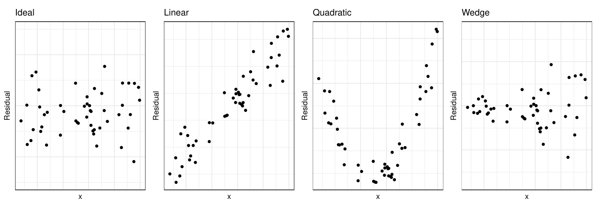

```{python}
#| echo: false
import pandas as pd
import numpy as np
import matplotlib.pyplot as plt
import seaborn as sns
import statsmodels.api as sm
from statsmodels.formula.api import ols
from scipy import stats
from ind5003 import inference
```

## What Is Regression? {.smaller}

Regression models the relationship between an **explanatory** variable $X$
and a **response** variable $Y$. Examples:

1. Per capita income (X) → life expectancy (Y).
2. Crab claw size (X) → closing force (Y).
3. Height (X) → weight (Y).

Two primary uses:

1. **Estimation** — understand how $X$ affects $Y$; focus on coefficient values.
2. **Prediction** — forecast $Y$ for new $X$ values (covered in supervised learning).

## Taiwan Real Estate Dataset {.smaller}

Real estate prices in the Xindian district, Taiwan (UCI repository).

```{python reg-load}
re2 = pd.read_csv("data/taiwan_dataset.csv")
print(re2.head(3))
```

Key columns: `house_age`, `dist_MRT` (metres), `num_stores`, `price`
(10,000 New Taiwan Dollars per Ping $\approx 3.3$ m²).

## Taiwan: Exploratory Data Analysis {.smaller}

```{python reg-eda}
#| fig-align: center
#| out-width: 85%
plt.figure(figsize=(9, 3));
ax = plt.subplot(131)
re2.plot(x='dist_MRT', y='price', kind='scatter', ax=ax, title='Distance to MRT')
ax = plt.subplot(132)
re2.plot(x='house_age', y='price', kind='scatter', ax=ax, title='House Age')
ax = plt.subplot(133)
z = re2.num_stores.unique(); z.sort()
tmp2 = np.array([re2.price[re2.num_stores == x].to_numpy() for x in z], dtype=object)
ax.boxplot(tmp2, tick_labels=z); ax.set_title('Num. of Stores');
```

## SLR: Formal Setup {.smaller}

Given $n$ observations $(X_i, Y_i)$, the **Simple Linear Regression** model is:

$$
Y_i = \beta_0 + \beta_1 X_i + e_i, \qquad e_i \overset{iid}{\sim} N(0, \sigma^2)
$$

Assumptions:

1. $E(Y_i \mid X_i) = \beta_0 + \beta_1 X_i$ (linear mean).
2. $\text{Var}(Y_i \mid X_i) = \sigma^2$ (homoscedasticity).
3. The $Y_i$ are **independent**.
4. The $Y_i$ are **Normally distributed**.

## SLR: OLS Estimation {.smaller}

Minimise the **error Sum of Squares**:

$$
SS_E = \sum_{i=1}^n (Y_i - \beta_0 - \beta_1 X_i)^2
$$

Taking partial derivatives and setting to 0 gives the **OLS estimates**:

$$
\hat{\beta}_1 = \frac{S_{XY}}{S_{XX}}, \qquad \hat{\beta}_0 = \bar{Y} - \hat{\beta}_1 \bar{X}
$$

where $S_{XY} = \sum X_i Y_i - \frac{(\sum X_i)(\sum Y_i)}{n}$, $\;S_{XX} = \sum X_i^2 - \frac{(\sum X_i)^2}{n}$.

## SLR: SS Decomposition {.smaller}

After fitting, residuals $r_i = Y_i - \hat{Y}_i$ lead to:

$$
\underbrace{\sum_{i=1}^n (Y_i - \bar{Y})^2}_{SS_T} =
\underbrace{\sum_{i=1}^n (Y_i - \hat{Y}_i)^2}_{SS_{Res}} +
\underbrace{\sum_{i=1}^n (\hat{Y}_i - \bar{Y})^2}_{SS_{Reg}}
$$

Estimate $\sigma^2$ with $\hat{\sigma}^2 = SS_{Res}/(n-2)$.

## SLR: F-Test and $R^2$ {.smaller}

**$F$-test** ($H_0: \beta_1 = 0$):

$$
F_0 = \frac{SS_{Reg}/1}{SS_{Res}/(n-2)} \;\sim\; F_{1,n-2} \text{ under } H_0
$$

**Coefficient of Determination:**

$$
R^2 = 1 - \frac{SS_{Res}}{SS_T} = \frac{SS_{Reg}}{SS_T} \in [0,1]
$$

Proportion of variation in $Y$ explained by $X$. Larger is better,
but $R^2$ alone is not enough — always check residuals.

## Taiwan: Price vs. House Age {.smaller}

```{python reg-slr-fit}
lm_house_age_1 = ols('price ~ house_age', data=re2).fit()
lm_house_age_1.summary(slim=True)
```

## Taiwan: Estimated Line {.smaller}

$\hat{Y} = 42.43 - 0.25 X_1$ (age). $R^2 = 0.044$ — only 4.4 % explained.

```{python reg-slr-plot}
#| fig-align: center
#| out-width: 65%
new_df = pd.DataFrame({'house_age': np.linspace(0, 45, 100)})
preds = lm_house_age_1.get_prediction(new_df)
ax = re2.plot(x='house_age', y='price', kind='scatter', alpha=0.4, figsize=(6, 3))
ax.plot(new_df.house_age, preds.conf_int()[:, 0], color='blue', linestyle='--')
ax.plot(new_df.house_age, preds.conf_int()[:, 1], color='blue', linestyle='--')
ax.plot(new_df.house_age, preds.predicted, color='blue');
```

## MLR: Formal Setup {.smaller}

With $p$ explanatory variables, the **Multiple Linear Regression** model is:

$$
\mathbf{Y} = \mathbf{X}\boldsymbol{\beta} + \mathbf{e}, \qquad \mathbf{e} \sim N(\mathbf{0}, \sigma^2 \mathbf{I})
$$

* $\mathbf{Y}$: $n \times 1$ response vector.
* $\mathbf{X}$: $n \times (p+1)$ design matrix (first column all 1s).
* $\boldsymbol{\beta}$: $(p+1) \times 1$ coefficient vector.

## MLR: Estimation {.smaller}

OLS estimate:

$$
\hat{\boldsymbol{\beta}} = (\mathbf{X}'\mathbf{X})^{-1}\mathbf{X}'\mathbf{Y}
$$

Fitted values: $\hat{\mathbf{Y}} = \mathbf{X}\hat{\boldsymbol{\beta}}$. $\;$
Residuals: $\mathbf{r} = \mathbf{Y} - \hat{\mathbf{Y}}$.

**Adjusted $R^2$** penalises for adding more variables:

$$
R^2_\text{adj} = 1 - \frac{SS_{Res}/(n-p)}{SS_T/(n-1)}
$$

## MLR: $F$-Test and Partial $t$-Tests {.smaller}

**Global $F$-test** ($H_0: \beta_1 = \cdots = \beta_p = 0$):

$$
F_1 = \frac{SS_{Reg}/p}{SS_{Res}/(n-p-1)} \;\sim\; F_{p,n-p-1}
$$

**Partial $t$-tests** for each $\beta_j$ test the contribution of $X_j$
**given all other variables are already in the model**.

## Taiwan: Price vs. Age + Distance {.smaller}

```{python reg-mlr-fit}
lm_age_mrt_1 = ols('price ~ house_age + dist_MRT', data=re2).fit()
lm_age_mrt_1.summary(slim=True)
```

Adj. $R^2 = 0.49$ — a big jump from the single-variable model!

## Broken Line Regression {.smaller}

Define $X_3 = \max(X_1 - 25, 0)$ to allow a **change in slope** at age 25:

```{python reg-broken}
re2['x3'] = [(x - 25) if x > 25 else 0 for x in re2.house_age]
lm_age_mrt_2 = ols('price ~ house_age + x3 + dist_MRT', data=re2).fit()
lm_age_mrt_2.summary(slim=True)
```

## Broken Line: Visualising the Fit {.smaller}

```{python reg-broken-plot}
#| fig-align: center
#| out-width: 70%
new_df = pd.DataFrame({'house_age': np.linspace(0, 45, 100)})
new_df['x3'] = [(x - 25) if x > 25 else 0 for x in new_df.house_age]
new_df2 = new_df.copy()
new_df['dist_MRT'] = 300; new_df2['dist_MRT'] = 1500
p1 = lm_age_mrt_2.get_prediction(new_df)
p2 = lm_age_mrt_2.get_prediction(new_df2)
ax = re2.plot(x='house_age', y='price', kind='scatter', alpha=0.4, figsize=(6, 3))
ax.plot(new_df.house_age, p1.predicted_mean, 'b--', label='dist=300m')
ax.plot(new_df2.house_age, p2.predicted_mean, 'r--', label='dist=1500m')
ax.legend();
```

## Categorical Variables {.smaller}

Categorical variables are coded as **dummy (indicator) variables**.

Example — 2 levels (Female / Male):

$$
X_3 = \begin{cases} 1 & \text{male} \\ 0 & \text{female (baseline)} \end{cases}
$$

For $a$ levels, use $a-1$ indicators (to avoid collinearity with the intercept).

The coefficient on $X_3$ represents the **intercept shift** for that group.

## Taiwan: Categorical num\_stores {.smaller}

```{python reg-cat-fit}
re2['num_stores_cat'] = ['low' if x <= 4 else 'high' for x in re2.num_stores]
lm_cat_1 = ols('price ~ dist_MRT + C(num_stores_cat, Treatment("low"))', re2).fit()
lm_cat_1.summary(slim=True)
```

## Interaction Terms {.smaller}

An **interaction** allows separate slopes for different groups:

$$
Y = \beta_0 + \beta_1 X_1 + \beta_2 X_2 + \beta_3 X_3 + \beta_4 X_2 X_3 + e
$$

* For males ($X_3=1$): intercept $= \beta_0 + \beta_3$, slope on $X_2 = \beta_2 + \beta_4$.
* For females ($X_3=0$): intercept $= \beta_0$, slope on $X_2 = \beta_2$.

Both the intercept **and** slope differ, unlike the previous section.

## Taiwan: Interaction Term {.smaller}

```{python reg-interact}
lm_cat_2 = ols('price ~ dist_MRT * C(num_stores_cat, Treatment("low"))', re2).fit()
lm_cat_2.summary(slim=True)
```

Highest adjusted $R^2$ so far — high-store locations have a steeper
negative relationship with distance.

## Standardised Residuals & Leverage {.smaller}

Residual variance is **not** constant:

$$
\text{Var}(r_i) = \sigma^2(1 - h_{ii})
$$

where $h_{ii}$ are diagonal elements of the **hat matrix**
$\mathbf{H} = \mathbf{X}(\mathbf{X}'\mathbf{X})^{-1}\mathbf{X}'$.

**Standardised residuals:**

$$
r_{i,\text{std}} = \frac{r_i}{\hat{\sigma}\sqrt{1-h_{ii}}}
$$

High leverage: $h_{ii} > 2p/n$.

## Residual Plot Patterns {.smaller}

{fig-align="center" width=80%}

1. **Random scatter** — ideal; model is adequate.
2. **Linear trend** — a new variable should be added.
3. **Curve** — include a quadratic or polynomial term.
4. **Funnel shape** — heteroscedasticity; use a transformation.

## Taiwan: Normality Check {.smaller}

```{python reg-normcheck}
#| fig-align: center
#| out-width: 60%
inference.check_normality(pd.Series(lm_age_mrt_1.resid_pearson))
```

Slight right skew and one clear outlier — view hypothesis tests with caution.

## Taiwan: Residual Scatterplots {.smaller}

```{python reg-resid}
#| fig-align: center
#| out-width: 75%
plt.figure(figsize=(10, 3.5))
r_s = lm_age_mrt_2.resid_pearson
ax = plt.subplot(121)
ax.scatter(re2.dist_MRT, r_s, alpha=0.5); ax.set_xlabel('dist_MRT')
ax.axhline(y=0, color='red', linestyle='--')
ax = plt.subplot(122)
ax.scatter(re2.house_age, r_s, alpha=0.5); ax.set_xlabel('house_age')
ax.axhline(y=0, color='red', linestyle='--');
```

`dist_MRT` shows curvature → try a log-transformation.

## Influential Points {.smaller}

Assess influence by the change in fitted values when point $i$ is omitted.
**Cook's distance** quantifies this for all fitted values simultaneously.

```{python reg-influence}
infl = lm_age_mrt_2.get_influence()
infl_df = infl.summary_frame()
print(infl_df.sort_values(by='cooks_d', ascending=False).head())
```

Index 270 stands out — worth investigating manually.

## Log-transformation {.smaller}

Replace `dist_MRT` with $\log(\texttt{dist\_MRT})$ to linearise the relationship:

```{python reg-log}
re2['ldist'] = np.log(re2.dist_MRT)
lm_age_mrt_3 = ols('price ~ house_age + x3 + num_stores + ldist',
                    data=re2).fit()
lm_age_mrt_3.summary(slim=True)
```

Adj. $R^2$ improves further — but always verify residuals before finalising.

## Summary {.smaller}

Linear regression is flexible, fast to fit, and **interpretable**:

* Keep only significant variables; prefer the **adjusted $R^2$** over $R^2$.
* Always inspect **residual plots** — the model is only valid when assumptions hold.
* Use **standardised residuals** to spot outliers.
* Use **Cook's distance** to find influential points.
* **Transformations** (log, polynomial, broken-line) extend the linear model
  to non-linear relationships.

Further topics: correlated errors, splines, kernel regression, robust linear models.
