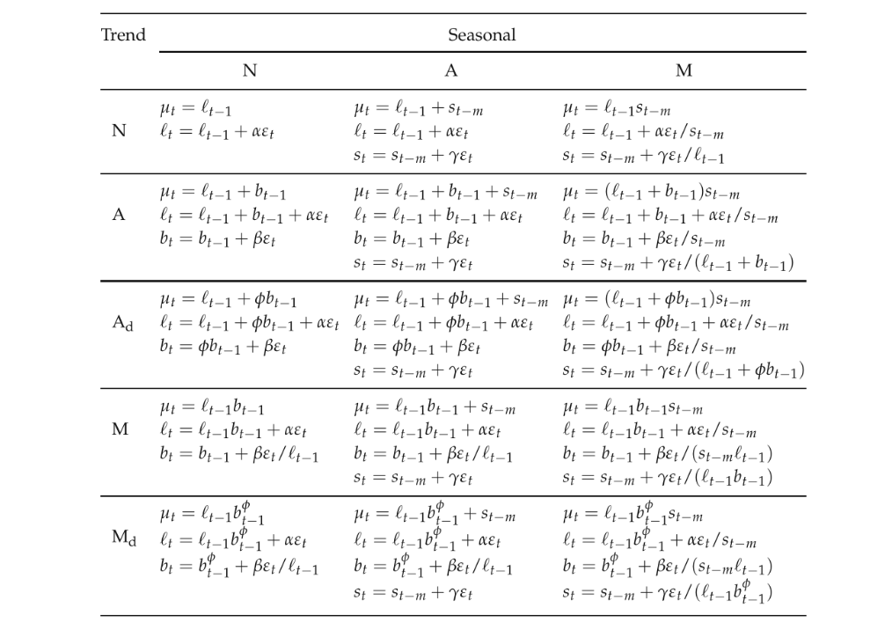
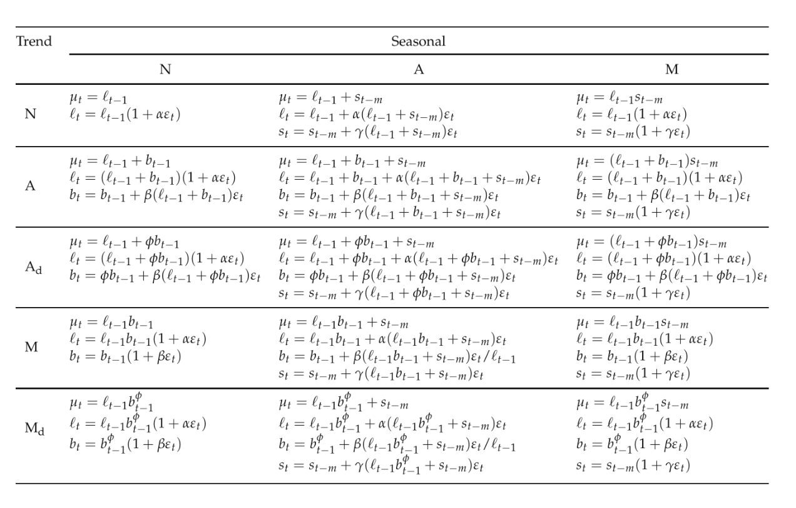

```{python}
#| echo: false
import pandas as pd
import numpy as np
import datetime, calendar
from statsmodels.tsa.seasonal import seasonal_decompose, STL
from statsmodels.tsa.statespace.tools import diff
from statsmodels.tsa.stattools import acf
from statsmodels.tsa.forecasting.theta import ThetaModel
from statsmodels.tsa.arima.model import ARIMA
from statsmodels.tsa.api import ExponentialSmoothing, STLForecast
from scipy.cluster import hierarchy
from scipy.spatial.distance import pdist
import pmdarima as pm
import matplotlib.pyplot as plt
import seaborn as sns
from ind5003 import ts
```

## Features of a Time Series {.smaller}

When visualising a time series, watch for:

1. **Trend** — long-term increase or decrease in the data.
2. **Level** — height of the series on the $y$-axis.
3. **Seasonal** — repeating pattern of **fixed and known** period
   (e.g. monthly, quarterly).
4. **Cyclic** — rises and falls of **unknown** period (years-long swings).

Most time series exhibit more than one of these features simultaneously.

## Housing Sales: Time Plot {.smaller}

Monthly US one-family house sales since 1973 (from the `fma` R package).

```{python ts-houses-load}
#| fig-align: center
#| out-width: 90%
hsales = pd.read_csv('data/hsales.csv', parse_dates=[0])
hsales.set_index('date', inplace=True)
hsales.index.freq = 'MS'
hsales.plot(title='Sales of One-Family Houses, USA', legend=False, figsize=(11, 3))
plt.xlabel('Month-Year'); plt.ylabel('Sales');
```

Strong seasonality; some cyclic behaviour; no monotonic trend.

## Housing Sales: Season Plot {.smaller}

```{python ts-houses-season}
#| fig-align: center
#| out-width: 85%
hsales.loc[:, 'year'] = hsales.index.year
hsales.loc[:, 'month'] = hsales.index.month
yrs = np.sort(hsales.year.unique())
colors_to_use = plt.cm.YlOrRd(np.linspace(0, 1, num=len(yrs)))
plt.figure(figsize=(9, 4))
for i, yr in enumerate(yrs):
    df_tmp = hsales.loc[hsales.year == yr, :]
    plt.plot(df_tmp.month, df_tmp.hsales, color=colors_to_use[i])
    plt.text(12.1, df_tmp.hsales.iloc[-1], str(yr), color=colors_to_use[i], fontsize=5)
plt.xlim(0, 13); plt.xticks(np.arange(1, 13), calendar.month_abbr[1:13])
plt.title('Season Plot: House Sales');
```

## Australian Electricity: Plots {.smaller}

Quarterly electricity production in Australia (billion kWh, from `fpp2` R package).

```{python ts-elec-load}
#| fig-align: center
#| out-width: 80%
qau = pd.read_csv('data/qauselec.csv', parse_dates=[0])
qau.set_index('date', inplace=True)
qau.index.freq = 'QS'
qau.plot(figsize=(9, 3), title='Electricity Production by Quarter', legend=False)
plt.xlabel('Qtr-Year'); plt.ylabel('Billion kWh');
```

Clear increasing trend, strong seasonality, no cyclic behaviour.

## Lag Plots {.smaller}

A **lag plot** at lag $k$ is a scatter plot of $y_t$ vs. $y_{t-k}$.
Strong linear structure at lag $k$ means observations $k$ apart are highly related.

```{python ts-lag}
#| fig-align: center
#| out-width: 70%
f, aa = plt.subplots(nrows=2, ncols=4, sharex=True, sharey=True, figsize=(10, 5))
y = hsales.hsales.values
for i in range(2):
    for j in range(4):
        lag = i * 4 + j + 1
        aa[i, j].scatter(y[:-lag], y[lag:], alpha=0.3, s=10)
        aa[i, j].set_xlabel("lag " + str(lag))
f.suptitle('Lag plots — housing sales');
```

## Decomposition: Additive vs. Multiplicative {.smaller}

**Additive** (constant seasonal amplitude):

$$y_t = T_t + S_t + R_t$$

**Multiplicative** (amplitude grows with trend):

$$y_t = T_t \times S_t \times R_t \quad\Rightarrow\quad \log y_t = \log T_t + \log S_t + \log R_t$$

Algorithm: (1) estimate trend $\hat{T}_t$; (2) de-trend; (3) estimate seasonal $\hat{S}_t$; (4) residual $\hat{R}_t$.

## Additive Decomposition: Housing Sales {.smaller}

```{python ts-add-decomp}
#| fig-align: center
#| out-width: 80%
hsales_add = seasonal_decompose(hsales.loc[:, 'hsales'],
                                model='additive', extrapolate_trend='freq')
ax = hsales_add.plot(); ax.set_figheight(4)
```

Seasonal spread $\approx 20$; trend spread $\approx 40$ — both are significant drivers.

## Multiplicative Decomposition: Electricity {.smaller}

```{python ts-mult-decomp}
#| fig-align: center
#| out-width: 80%
qau_mult = seasonal_decompose(qau.loc[:, 'kWh'], model='multiplicative',
                              extrapolate_trend='freq')
ax = qau_mult.plot(); ax.set_figheight(4)
```

Note: residuals in multiplicative decompositions are centred around **1**.

## STL Decomposition {.smaller}

**STL** (Seasonal-Trend decomposition using Loess) addresses classical limitations:

* Estimates trend at the **endpoints** of the series.
* Handles **changing seasonal patterns**.
* **Robust** to outliers via iterated weighted fitting.

```{python ts-stl}
#| fig-align: center
#| out-width: 75%
qau_stl = STL(qau.kWh).fit()
ax = qau_stl.plot(); ax.set_figheight(4)
```

## Benchmark Forecasting Methods {.smaller}

Notation: $\hat{y}_{T+h|T}$ = forecast at time $T+h$ given data up to $T$.

**A. Mean forecast:**
$\hat{y}_{T+h|T} = (y_1 + \cdots + y_T)/T$

**B. Naive forecast:**
$\hat{y}_{T+h|T} = y_T$

**C. Seasonal naive** (season length $d$):
$\hat{y}_{T+h|T} = y_{T-d+h}$

Always obtain a benchmark before deploying complex models.

## Housing Sales: Benchmark Forecasts {.smaller}

```{python ts-bench-plot}
#| fig-align: center
#| out-width: 88%
train_set = hsales.iloc[:-24, ]; test_set = hsales.iloc[-24:, ]
mean_forecast = ts.meanf(train_set.hsales, 24)
snaive_forecast = ts.snaive(train_set.hsales, 24, 12)
ax = train_set.hsales.plot(title='Benchmarks', legend=False, figsize=(11, 4))
test_set.hsales.plot(ax=ax, style='--', legend=False)
mean_forecast.plot(ax=ax, style='-'); snaive_forecast.plot(ax=ax, style='-')
plt.legend(labels=['train', 'test', 'mean', 'snaive'], loc='lower right');
```

## Forecast Error Metrics {.smaller}

| Metric | Formula | Notes |
|--------|---------|-------|
| **RMSE** | $\sqrt{\frac{1}{h}\sum(y_t - \hat{y}_t)^2}$ | scale-dependent; sensitive to outliers |
| **MAE** | $\frac{1}{h}\sum|y_t - \hat{y}_t|$ | scale-dependent; robust to outliers |
| **MASE** | $\frac{1}{h}\sum\frac{|y_t - \hat{y}_t|}{\frac{1}{T-1}\sum|y_t - y_{t-1}|}$ | scale-free; compare across series |

```{python ts-bench-err}
for x in [ts.rmse, ts.mae]:
    print(f"{x.__name__}, mean:   {x(test_set.hsales.values, mean_forecast.values):.3f}")
    print(f"{x.__name__}, snaive: {x(test_set.hsales.values, snaive_forecast.values):.3f}")
```

## ARIMA: Stationarity {.smaller}

ARIMA models require a **stationary** series — one with:

* **Constant mean** over time.
* **Constant variance** over time.
* Covariance between $y_t$ and $y_{t+h}$ depends only on $h$, not $t$.

**Differencing** transforms a non-stationary series to a stationary one:

$$\Delta y_t = y_t - y_{t-1}$$

The **ACF** (AutoCorrelation Function) of a stationary process should die down quickly.

## Dow Jones: Differencing {.smaller}

```{python ts-dow}
#| fig-align: center
#| out-width: 88%
dj = pd.read_csv('data/dj.csv')
ddj = diff(dj)
plt.figure(figsize=(10, 4))
plt.subplot(211); plt.plot(dj.values); plt.title('Dow Jones (non-stationary)')
plt.subplot(212); plt.plot(ddj); plt.title('Differenced (stationary)');
plt.tight_layout()
```

## ACF: Before and After Differencing {.smaller}

```{python ts-acf}
#| fig-align: center
#| out-width: 75%
plt.figure(figsize=(8, 5))
plt.subplot(211); plt.stem(acf(dj, fft=False)); plt.title('Non-differenced')
plt.subplot(212); plt.stem(acf(ddj, fft=False)); plt.title('Differenced')
plt.tight_layout();
```

Differenced series ACF decays quickly — sign of stationarity.

## ARIMA Model Equation {.smaller}

After $d$ differencings, the stationary series $y'_t$ follows:

$$
y'_t = c + \phi_1 y'_{t-1} + \cdots + \phi_p y'_{t-p} +
       \theta_1 e_{t-1} + \cdots + \theta_q e_{t-q}
$$

* $p$ — **AR** (autoregressive) order; past *values*.
* $d$ — **Integration**; number of differencings.
* $q$ — **MA** (moving average) order; past *innovations*.

Denoted $\text{ARIMA}(p, d, q)$. With seasonal terms: $\text{SARIMA}(p,d,q)(P,D,Q)_m$.

## Auto ARIMA on Aus Electricity {.smaller}

`pmdarima.auto_arima` iterates over models and selects the best via **AIC**.

```{python ts-auto-arima}
#| echo: false
import warnings
warnings.filterwarnings("ignore", message=r".*'force_all_finite'.*", category=FutureWarning)
train2 = qau.kWh[:-12]; test2 = qau.kWh[-12:]
arima_m1 = pm.auto_arima(train2.values, seasonal=True, m=4, test='adf',
                         trace=False, suppress_warnings=True)
```

```{python ts-arima-show}
#| eval: false
arima_m1 = pm.auto_arima(train2.values, seasonal=True, m=4, test='adf',
                         trace=False, suppress_warnings=True)
```

```{python ts-arima-summ}
arima_m1.summary()
```

## ARIMA: Residual Diagnostics {.smaller}

```{python ts-arima-diag}
#| fig-align: center
#| out-width: 80%
arima_m1.plot_diagnostics(figsize=(11, 5));
```

Check: standardised residuals (constant spread), histogram + QQ-plot (Normality),
ACF (no remaining autocorrelation).

## ARIMA: Test Set Performance {.smaller}

```{python ts-arima-err}
rmse1 = ts.rmse(test2.values, arima_m1.predict(n_periods=12))
mase1 = ts.mase(test2.values, arima_m1.predict(n_periods=12),
                train2.values, seasonality=4)
print(f"RMSE on test set: {rmse1:.3f}")
print(f"MASE on test set: {mase1:.3f}")
```

```{python ts-arima-plot}
#| fig-align: center
#| out-width: 80%
fc, confint = arima_m1.predict(n_periods=12, return_conf_int=True)
ff = pd.Series(fc, index=test2.index)
plt.figure(figsize=(10, 4))
plt.plot(train2[-36:]); plt.plot(ff, color='red', label='Forecast')
plt.fill_between(ff.index, confint[:, 0], confint[:, 1], alpha=0.15)
plt.plot(test2, 'g--', label='True'); plt.legend();
```

## ETS Models {.smaller}

**ETS** (Error–Trend–Seasonality) — state space equations:

$$
y_t = w' x_{t-1} + e_t, \qquad x_t = F x_{t-1} + g e_t
$$

The hidden **state** $x_t$ tracks level, trend, and seasonal components.
Updates are weighted averages of recent observations.

Simplest model **ETS(A,N,N)** — level only:

$$
l_t = \alpha y_t + (1-\alpha) l_{t-1}, \qquad \hat{y}_{t+1} = l_t
$$

## ETS: Additive and Multiplicative Models {.smaller}

:::: {.columns}

::: {.column width="50%"}
{width=95%}
:::

::: {.column width="50%"}
{width=95%}
:::

::::

ETS does **not** require stationarity. It can handle multiplicative growth
and damped trends.

## ETS(A,A,A) on Aus Electricity {.smaller}

```{python ts-ets-fit}
ets_m1 = ExponentialSmoothing(train2.values, seasonal_periods=4,
                              trend='add', seasonal='add')
ets_fit = ets_m1.fit()
ets_fc = ets_fit.forecast(steps=12)
print(f"RMSE on test set: {ts.rmse(test2.values, ets_fc):.3f}")
```

```{python ts-ets-plot}
#| fig-align: center
#| out-width: 70%
plt.subplot(211); plt.plot(train2.index, ets_fit.trend, scaley=False)
plt.ylim(0.245, 0.255); plt.ylabel('slope')
plt.subplot(212); plt.plot(train2.index, ets_fit.level)
plt.ylabel('level'); plt.tight_layout();
```

## Theta Method {.smaller}

Decomposes a *seasonally adjusted* series into **short-** and **long-term** trends:

$$
y_t = \tfrac{1}{2}(x_{\theta, t} + x_{1-\theta, t})
$$

Forecast each component separately, then combine. Proven effective in
forecasting competitions.

## Singapore Tourism: Theta Model {.smaller}

```{python ts-tourism-load}
#| fig-align: center
#| out-width: 85%
tourism = pd.read_excel("data/international_visitor_arrivals_sg.xlsx",
                        parse_dates=[0], date_format="%Y %b", na_values='na')
sea_tourism = tourism.iloc[:, 0:9]
sea_tourism.columns = ['Date','SEA','Brunei','Indonesia','Malaysia',
                        'Myanmar','Philippines','Thailand','Vietnam']
sea_tourism.Date = pd.to_datetime(sea_tourism.Date.str.replace('  ',''), format="%Y %b")
sea_tourism.set_index('Date', inplace=True); sea_tourism.sort_index(inplace=True)
sea_tourism.index.freq = 'MS'
sea2 = sea_tourism.SEA[sea_tourism.index < datetime.datetime(2020, 1, 1)]
sea2.plot(figsize=(10, 3), title='Monthly Arrivals from SEA Countries (pre-COVID)');
```

## Theta Forecasts {.smaller}

```{python ts-theta-fit}
theta_mod = ThetaModel(sea2)
theta_mod_fit = theta_mod.fit()
```

```{python ts-theta-plot}
#| fig-align: center
#| out-width: 85%
theta_forecasts = pd.DataFrame({"original": sea2,
                                 "theta forecast": theta_mod_fit.forecast(24)})
theta_forecasts.tail(360).plot(figsize=(10, 3.5));
```

## Forecasting via Seasonal Decomposition {.smaller}

Use **STL** to decompose the series, then fit **ARIMA** to the seasonally adjusted component.

```{python ts-stlf}
#| fig-align: center
#| out-width: 85%
stlf = STLForecast(sea2, ARIMA, model_kwargs={"order": (3, 1, 2)})
res = stlf.fit()
forecasts2 = pd.DataFrame({"original": sea2, "dcmp forecast": res.forecast(24)})
forecasts2.tail(360).plot(figsize=(10, 3.5));
```

## Time Series Clustering {.smaller}

Cluster 148 US employment time series using **correlation distance** and
**average linkage** hierarchical clustering.

```{python ts-clust}
#| fig-align: center
#| out-width: 75%
us_employment = pd.read_csv("data/us_employment.csv", parse_dates=[0], date_format="%Y %b")
us_full = us_employment[(us_employment.Month >= datetime.datetime(2002, 9, 30)) &
                         (us_employment.Month < datetime.datetime(2018, 1, 1))]
us2 = us_full.pivot(index='Series_ID', columns='Month', values='Employed')
out = pdist(us2.to_numpy(), metric='correlation')
lm1 = hierarchy.linkage(out, method='average', optimal_ordering=True)
plt.figure(figsize=(11, 4))
hierarchy.dendrogram(lm1, p=3, truncate_mode='level', color_threshold=True);
```

## Time Series Clustering: Heatmap {.smaller}

Reorder series by dendrogram leaf order, then display the correlation matrix.

```{python ts-heatmap}
#| fig-align: center
#| out-width: 60%
X_ord = us2.to_numpy()[hierarchy.leaves_list(lm1)]
corr_mat_ord = np.corrcoef(X_ord)
plt.figure(figsize=(8, 8))
sns.heatmap(corr_mat_ord, vmin=-1, vmax=1, cmap='coolwarm_r', center=0);
```

## Summary {.smaller}

Key takeaways for time series analysis:

* **Visualise** first — time plot, season plot, lag plot, ACF.
* **Decompose** to understand trend, seasonal, and residual components.
* **Benchmark** before fitting complex models (mean, naive, seasonal naive).
* **ARIMA** — for stationary (or made-stationary) series; auto-select with AIC.
* **ETS** — state space approach; handles non-stationary data natively.
* **Theta** — proven competitive in forecasting competitions.
* Always **inspect residuals** from the fitted model.
