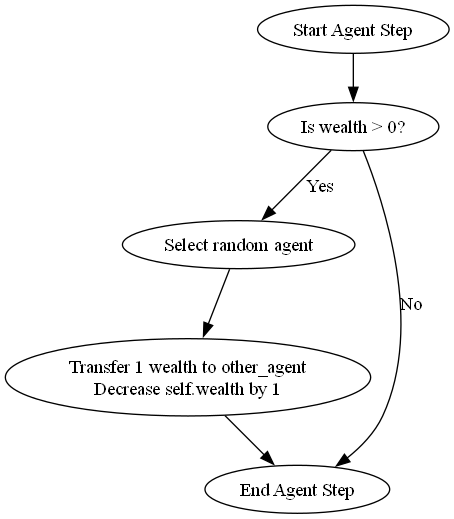
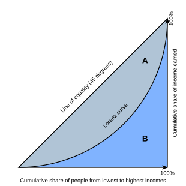
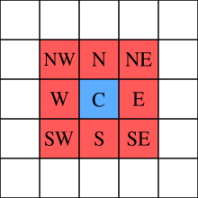

```{python}
#| echo: false
from math import pi
import pprint
import mesa
import seaborn as sns
import matplotlib.pyplot as plt
import nltk
from nltk import word_tokenize
from numpy.random import default_rng
import numpy as np
import pandas as pd
from scipy import stats
from scipy.stats import binom, bernoulli, norm, expon, uniform
```

## Random Variables {.smaller}

A **random variable** is a real-valued function describing a probabilistic
phenomenon. Examples:

* $X = 1$ (Heads) with probability $2/3$; $X = 0$ (Tails) with probability $1/3$.

The **probability mass function (pmf)** or **density (pdf)** encodes everything
about the variable: mean, variance, quantiles.

```{python sim-biased-coin}
#| fig-align: center
#| out-width: 40%
plt.figure(figsize=(4, 2.5))
plt.bar([0, 1], [1/3, 2/3], tick_label=['0', '1'], width=0.3)
plt.xlim(-1, 2); plt.ylim(0, 1); plt.title("pmf of biased coin");
```

## Discrete Random Variables {.smaller}

Take on a **countable** number of values. Defined by their **pmf**.

Example — number of Heads in 10 tosses of the biased coin ($p = 2/3$):

```{python sim-binom}
#| fig-align: center
#| out-width: 55%
plt.figure(figsize=(5, 3))
probs = binom.pmf(np.arange(0, 11), n=10, p=2/3)
plt.bar(np.arange(0, 11), probs); plt.ylim(0, 1)
plt.title('pmf of number of Heads (10 tosses, p=2/3)');
```

## Continuous Random Variables {.smaller}

Take on an **uncountable** range of values; defined by a **pdf**.

```{python sim-cts-rv}
#| fig-align: center
#| out-width: 75%
x = np.linspace(-3, 3, 100)
plt.figure(figsize=(8, 3))
plt.subplot(131); plt.plot(x, norm.pdf(x)); plt.ylim(0, 1); plt.title('Normal')
plt.subplot(132); plt.plot(x[x > 0], expon.pdf(x[x > 0])); plt.ylim(0, 1); plt.title('Exponential')
x2 = np.linspace(0, 1, 100)
plt.subplot(133); plt.plot(x2, uniform.pdf(x2)); plt.ylim(0, 1.1); plt.title('Uniform');
plt.tight_layout()
```

## Generating Random Variates {.smaller}

Use `default_rng(seed)` for reproducibility.

```{python sim-rvgen}
#| fig-align: center
#| out-width: 75%
rng = default_rng(5003)
yvals = np.zeros((3, 300))
yvals[0, :] = rng.normal(size=300)
yvals[1, :] = rng.exponential(size=300)
yvals[2, :] = rng.uniform(size=300)
plt.figure(figsize=(8, 3))
for i, name in enumerate(['Normal', 'Exponential', 'Uniform']):
    plt.subplot(1, 3, i+1); plt.hist(yvals[i, :], density=True, histtype='step')
    plt.title(name); plt.ylim(0, 1.05)
plt.tight_layout()
```

Histograms converge to the pdf as $n$ increases — the **SLLN** at work.

## Simulation Study Goals {.smaller}

A simulation study estimates $E(X)$ by generating independent copies of $X$:

1. **Scenario planning** — estimate throughput under different assumptions.
2. **Emergent behaviour** — study complex systems where analytic solutions are unavailable.

:::: {.columns}

::: {.column width="48%"}
**Insurance Claims**

Total claims $Y$ = sum of $\text{Poisson}(8.2)$ claims, each $\sim \text{Exp}(1/200)$.

*Estimate* $P(Y > 12{,}000)$.
:::

::: {.column width="48%"}
**Sandwich Shop**

Inter-arrival times $\sim \text{Exp}(3)$ hours; shop closes at 5 pm.

*Estimate* mean overtime.
:::

::::

## Steps in a Simulation Study {.smaller}

1. **Identify** the random variable of interest $X$; write a program to simulate it.
2. **Generate** an iid sample $X_1, X_2, \ldots, X_n$.
3. **Estimate** $E(X)$ using $\bar{X}$.

## Supporting Theory: SLLN and CLT {.smaller}

**Strong Law of Large Numbers:**

$$
\bar{X} = \frac{1}{n}\sum_{i=1}^n X_i \xrightarrow{} E(X) \quad \text{with probability 1}
$$

**Central Limit Theorem:**

$$
\frac{\sqrt{n}(\bar{X} - \mu)}{\sigma} \Rightarrow N(0,1) \quad \text{as } n \to \infty
$$

**$(1-\alpha)100\%$ CI for $\mu$:**

$$
\bar{X} \pm z_{1-\alpha/2}\frac{s}{\sqrt{n}}
$$

For estimating a probability $p$: $\;\bar{X} \pm z_{1-\alpha/2}\sqrt{\bar{X}(1-\bar{X})/n}$.

## Object-Oriented Programming in Python {.smaller}

A **class** is a template; an **instance** is one copy of the template.

```{python sim-class}
class Circle:
    def __init__(self, radius=1.0):
        self.radius = radius
    def area(self):
        return pi * (self.radius ** 2)

c1 = Circle(3.2); c2 = Circle(4.0)
print(f"c1 area: {c1.area():.3f},  c2 area: {c2.area():.3f}")
```

`self` refers to the specific instance being operated on.

## Agent-Based Models {.smaller}

An **Agent-Based Model (ABM)** consists of agents that interact with each other.
The goal is to understand how **system-level behaviour** emerges from
**simple individual rules**.

Examples:

* COVID-19 spread modelling.
* Traffic simulation.
* Swarm behaviour (fish, locusts).
* Marketing network effects.

Characteristics: agents at multiple scales; decision-making behaviours;
interactions in time (and possibly space).

## Mesa: Key Concepts {.smaller}

**Mesa** is a Python ABM framework. Two core components:

1. **Agent class** — defines initialisation and the `step()` method
   (what the agent does each time step).
2. **Model class** — creates agents, manages the scheduler, and collects data.

A **step** (or "tick") is the smallest unit of simulation time.

## Boltzmann Wealth Model {.smaller}

A simple model from social science:

1. $N$ agents, each starting with 1 unit of money.
2. At every step, each agent gives 1 unit (if it has any) to a **randomly chosen** agent.

What do you expect the wealth distribution to look like after many steps?

## MoneyAgent and MoneyModel (v1) {.smaller}

```{python sim-agent-v1}
class MoneyAgent(mesa.Agent):
    def __init__(self, model):
        super().__init__(model); self.wealth = 1

    def step(self):
        if self.wealth > 0:
            other_agent = self.rng.choice(self.model.agents)
            other_agent.wealth += 1; self.wealth -= 1

class MoneyModel(mesa.Model):
    def __init__(self, N, rng=None):
        super().__init__(rng=rng); self.num_agents = N
        MoneyAgent.create_agents(model=self, n=N)
    def step(self):
        self.agents.shuffle_do("step")
```

## Agent Flowchart {.smaller}

{fig-align="center" width=40%}

Sketch a flowchart before coding — it clarifies logic and aids debugging.

## Boltzmann: Simple Run {.smaller}

```{python sim-v1-run}
rng2 = default_rng(5023)
all_wealth = []
model = MoneyModel(N=10, rng=rng2)
for i in range(100):
    model.step()
for agent in model.agents:
    all_wealth.append(agent.wealth)
prop = (np.array(all_wealth) == 0).mean()
print(f"Proportion of agents with zero wealth: {prop:.3f}")
```

## Data Collection in Mesa {.smaller}

```{python sim-datacoll}
def compute_zero_prop(mesa_model):
    w = [agent.wealth for agent in mesa_model.agents]
    return (np.array(w) == 0).mean()

class MoneyModel(mesa.Model):
    def __init__(self, N, rng=None):
        super().__init__(rng=rng); self.num_agents = N
        MoneyAgent.create_agents(model=self, n=N)
        self.datacollector = mesa.DataCollector(
            model_reporters={"zero_prop": compute_zero_prop})
    def step(self):
        self.agents.shuffle_do("step")
        self.datacollector.collect(self)
```

## Boltzmann: Batch Run (50 Iterations) {.smaller}

```{python sim-batch-v1}
params = {"N": 10}
results = mesa.batch_run(MoneyModel, parameters=params, rng=[None]*50,
                         max_steps=100, number_processes=1,
                         data_collection_period=-1)
results_df = pd.DataFrame(results)
```

```{python sim-batch-plot}
#| fig-align: center
#| out-width: 55%
results_df.zero_prop.hist(grid=False, bins=np.arange(0.10, 1.00, 0.05), figsize=(4, 3))
plt.xlabel('Proportion zero-wealth agents');
```

## Gini Coefficient {.smaller}

Measures **income inequality** via the Lorenz curve.

{fig-align="center" width=35%}

$$
\text{Gini} = \frac{A}{A+B} \in [0,1]
$$

$0$ = perfect equality; $1$ = one person holds all the wealth.

## MoneyModel v2: Adding Gini {.smaller}

```{python sim-gini-fn}
def compute_gini(model):
    x = sorted([agent.wealth for agent in model.agents])
    N = model.num_agents
    B = sum(xi * (N - i) for i, xi in enumerate(x)) / (N * sum(x))
    return 1 + (1 / N) - 2 * B

class MoneyModel(mesa.Model):
    def __init__(self, N, rng=None):
        super().__init__(rng=rng); self.num_agents = N
        MoneyAgent.create_agents(model=self, n=N)
        self.datacollector = mesa.DataCollector(
            model_reporters={"Gini": compute_gini,
                             "zero_prop": compute_zero_prop})
    def step(self):
        self.agents.shuffle_do("step")
        self.datacollector.collect(self)
```

```{python sim-gini-run}
params = {"N": 10}
results = mesa.batch_run(MoneyModel, parameters=params, rng=[None]*50,
                         max_steps=100, number_processes=1, data_collection_period=1)
results_df = pd.DataFrame(results)
```

## Evolution of Gini Coefficient {.smaller}

```{python sim-gini-plot}
#| fig-align: center
#| out-width: 75%
grp_by_step = results_df.Gini.groupby(results_df.Step).describe()
grp_by_step[['25%', '50%', '75%']].plot(style=['--', '-', '--'], figsize=(8, 3.5))
plt.ylim([0, 1]); plt.title('Gini Coefficient over 100 Steps (50 iterations)');
```

The model quickly reaches Gini values comparable to real-world inequalities!

## MoneyModel v3: Spatial Component {.smaller}

Agents now live on a **MultiGrid** and only give money to neighbours.

```{python sim-spatial}
class MoneyAgent(mesa.Agent):
    def __init__(self, model):
        super().__init__(model); self.wealth = 1
    def move(self):
        possible_steps = self.model.grid.get_neighborhood(self.pos, moore=True, include_center=False)
        self.model.grid.move_agent(self, self.random.choice(possible_steps))
    def give_money(self):
        cellmates = self.model.grid.get_cell_list_contents([self.pos])
        cellmates.pop(cellmates.index(self))
        if len(cellmates) >= 1:
            other = self.random.choice(cellmates); other.wealth += 1; self.wealth -= 1
    def step(self):
        self.move()
        if self.wealth > 0: self.give_money()
```

## Moore Neighbourhood {.smaller}

:::: {.columns}

::: {.column width="40%"}
{width=80%}

Each agent can move to one of up to 8 neighbouring cells.
:::

::: {.column width="58%"}
```{python sim-v3-run}
#| fig-align: center
#| out-width: 90%
class MoneyModel(mesa.Model):
    def __init__(self, N, width, height, rng=None):
        super().__init__(rng=rng); self.num_agents = N
        self.grid = mesa.space.MultiGrid(width, height, True)
        for i in range(N):
            a = MoneyAgent(self)
            x = self.random.randrange(self.grid.width)
            y = self.random.randrange(self.grid.height)
            self.grid.place_agent(a, (x, y))
        self.datacollector = mesa.DataCollector(
            model_reporters={"Gini": compute_gini},
            agent_reporters={"Wealth": "wealth"})
    def step(self):
        self.datacollector.collect(self); self.agents.shuffle_do("step")
model = MoneyModel(100, 10, 10)
for i in range(100): model.step()
gini = model.datacollector.get_model_vars_dataframe()
sns.lineplot(data=gini); plt.title("Gini over time (single run)");
```
:::

::::

## N-gram Language Model {.smaller}

Simulate sentences using the **bigram distribution** of a corpus.

```{python sim-ngram}
#nltk.download('genesis')
kjv = nltk.corpus.genesis.words('english-kjv.txt')
bg = nltk.bigrams(kjv)
cfd = nltk.ConditionalFreqDist(bg)
```

```{python sim-generate}
rng_ngram = default_rng(1361)
def generate_model(cfdist, word, num=15):
    for i in range(num):
        print(word, end=' ')
        choices = np.array(list(cfdist[word].keys()))
        pp = np.array(list(cfdist[word].values())); pp = pp / pp.sum()
        word = rng_ngram.choice(choices, size=1, p=pp)[0]
generate_model(cfd, 'God', 10)
```

## Power Analysis via Simulation {.smaller}

**Power** = probability of correctly rejecting a false $H_0$.

Simulate 2-sample $t$-tests to find the sample size achieving power $\geq 0.9$
when detecting a difference of 1, with $\sigma = 1.2$ and $\alpha = 5\%$.

```{python sim-power}
#| fig-align: center
#| out-width: 65%
rng_pw = default_rng(4545)
def one_sample(alpha, delta, sd, n):
    X = rng_pw.standard_normal(n)*sd; Y = rng_pw.standard_normal(n)*sd + delta
    return 1 if stats.ttest_ind(X, Y).pvalue < alpha else 0

n_vals = np.arange(5, 50, step=4)
power_est = [np.mean([one_sample(0.05, 1, 1.2, n) for _ in range(2000)]) for n in n_vals]
plt.plot(n_vals, power_est, 'go-'); plt.hlines(0.9, n_vals[0], n_vals[-1], linestyles='dotted')
plt.xlabel('n'); plt.ylabel('Power'); plt.title('Power Estimates');
```

## Power Analysis: Conclusion {.smaller}

The plot indicates a sample size of approximately **35** per group is needed.

## Summary: Simulation Guidelines {.smaller}

**Questions to address in any simulation study:**

1. What input distributions should I use?
2. How complicated must the simulation be?
3. How do I verify correctness?
4. How many runs are needed?

**General guidelines:**

1. Start simple.
2. Use your own data to calibrate distributions.
3. Test sensitivity to distributional assumptions.
4. Add more realistic layers incrementally.
5. Report confidence intervals around all estimates.
