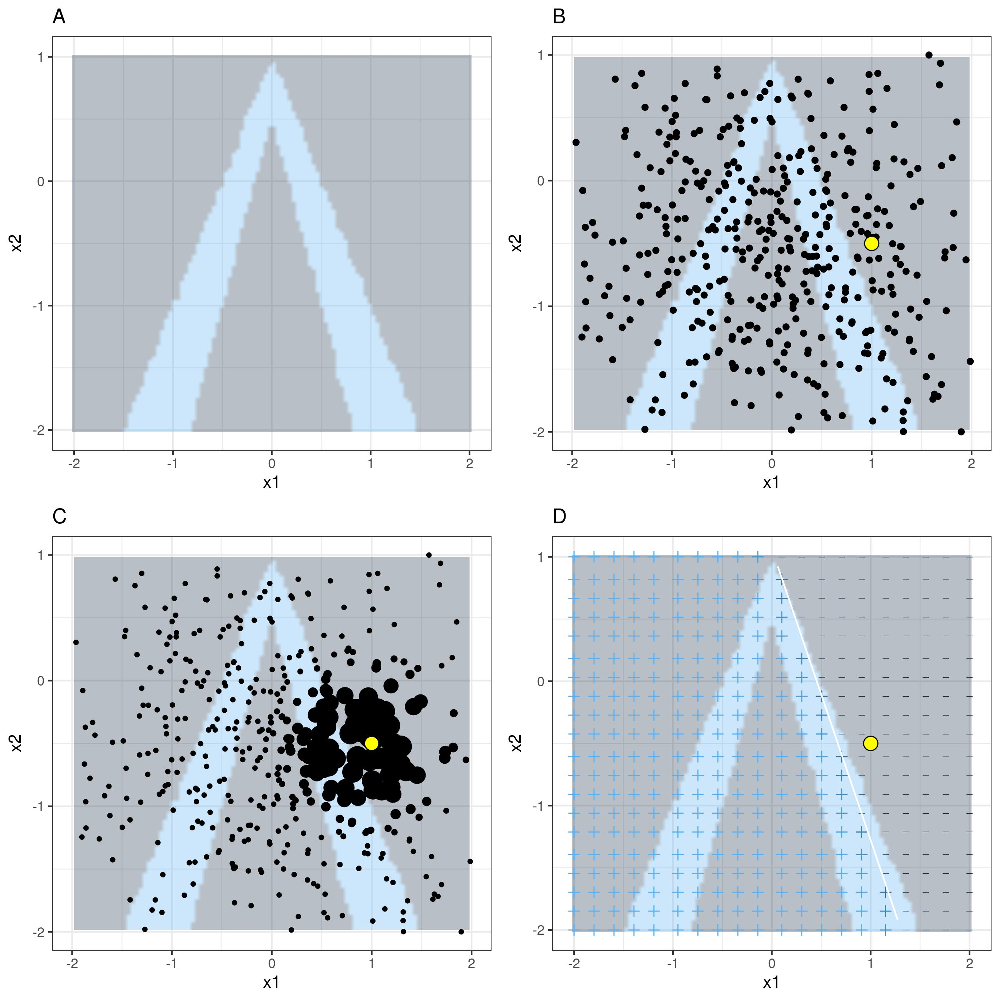

```{python}
#| echo: false
import pandas as pd
import numpy as np
import matplotlib.pyplot as plt
from lime import lime_tabular
from sklearn import tree
from sklearn.ensemble import RandomForestClassifier, RandomForestRegressor
from sklearn.metrics import (
    accuracy_score, f1_score, confusion_matrix,
    ConfusionMatrixDisplay, precision_score, recall_score, r2_score)
from sklearn.model_selection import (
    cross_val_score, GridSearchCV, train_test_split)
from sklearn.inspection import (
    permutation_importance, PartialDependenceDisplay, partial_dependence)
from sklearn.neighbors import KNeighborsRegressor
from sklearn.preprocessing import StandardScaler
```

## What Is Supervised Learning? {.smaller}

Algorithms learn from a **training set of labelled examples** $(X_i, y_i)$
to predict the label $y$ for new, unseen inputs $X$.

Examples:

1. Predict whether a student will graduate based on academic records.
2. Predict tomorrow's stock price from historical prices.

Contrast with **unsupervised learning**: here we have labels!

## Classification vs. Regression {.smaller}

| Problem type | Response $y$ | Examples |
|---|---|---|
| **Classification** | discrete class | cancer/no-cancer, fraud/not-fraud |
| **Regression** | continuous value | rental price, delivery time |

Classification algorithms output class labels (or probabilities).
Regression algorithms output real-valued predictions.

## Supervised Learning Workflow {.smaller}

{fig-align="center" width=55%}

1. **Split** into train / test (80/20 or 75/25). **Never touch the test set until the end.**
2. **Pre-process** training data (scale, encode); save parameters for the test set.
3. **Tune hyperparameters** via cross-validation on the training set.
4. **Evaluate** the chosen model on the held-out test set.

## Scikit-learn: Three Interfaces {.smaller}

All estimators in scikit-learn expose:

| Interface | Method | Purpose |
|---|---|---|
| **Estimator** | `.fit(X, y)` | learn parameters from data |
| **Predictor** | `.predict(X)` | make predictions on new data |
| **Transformer** | `.transform(X)` | convert / pre-process data |

These interfaces are consistent across **all** algorithms in the library.

## Input Data Structure {.smaller}

**Feature matrix** $\mathbf{X}$ ($n \times d$):

$$
\mathbf{X} = \begin{bmatrix}
x_{1,1} & \cdots & x_{1,d}\\
\vdots & & \vdots \\
x_{n,1} & \cdots & x_{n,d}
\end{bmatrix}
$$

$n$ rows = samples; $d$ columns = features.

**Label vector** $\mathbf{y}$ ($n \times 1$): one value per sample.

## Classification Metrics: Accuracy {.smaller}

$$
\text{accuracy} = \frac{\text{correct predictions}}{\text{total predictions}}
$$

**Confusion matrix** (binary case):

|  | Predicted + | Predicted − |
|---|---|---|
| **True +** | TP | FN |
| **True −** | FP | TN |

Accuracy hides class imbalance — examine the full confusion matrix.

## Precision, Recall, and F1 {.smaller}

$$
\text{Recall} = \frac{TP}{TP + FN} \qquad \text{Precision} = \frac{TP}{TP + FP}
$$

$$
F1 = 2 \times \frac{\text{precision} \times \text{recall}}{\text{precision} + \text{recall}}
$$

* **Recall** — how many true positives did we catch?
* **Precision** — of predicted positives, how many were correct?
* **F1** — harmonic mean; low if either precision or recall is low.

## Regression Metrics {.smaller}

$$
\text{RMSE} = \sqrt{\frac{1}{n}\sum_{i=1}^n (y_i - \hat{y}_i)^2}
$$

$$
\text{MAE} = \frac{1}{n}\sum_{i=1}^n |y_i - \hat{y}_i|
$$

RMSE amplifies large errors; MAE is more robust to outliers.

## Heart Failure Dataset {.smaller}

299 patients; 13 clinical features; outcome: `DEATH_EVENT` (0 or 1).

```{python sl-hf-load}
hf = pd.read_csv("data/heart+failure+clinical+records/"
                 "heart_failure_clinical_records_dataset.csv")
print(hf.head(3))
```

Key features: `time` (follow-up days), `ejection_fraction`, `serum_creatinine`.

## Decision Tree: Concept {.smaller}

A hierarchical sequence of **binary splits** on features. At each node:

* Try all features and all split points.
* Choose the split that most reduces **Gini impurity**:

$$
\text{Gini} = p_0(1 - p_0)
$$

**Advantages**: easy to visualise and interpret.
**Disadvantages**: high variance (sensitive to training data), tends to overfit.

## Train-Test Split {.smaller}

```{python sl-split}
y = hf.DEATH_EVENT
X = hf.iloc[:, 0:12]

X_train, X_test, y_train, y_test = train_test_split(
    X, y, test_size=0.25, random_state=41, stratify=y)

print(f"Overall proportion of 1's: {y.mean():.3f}")
print(f"Training proportion:       {y_train.mean():.3f}")
print(f"Test proportion:           {y_test.mean():.3f}")
```

`stratify=y` preserves class proportions in both splits.

## Fitting and Predicting {.smaller}

```{python sl-dt-fit}
clf = tree.DecisionTreeClassifier(max_depth=4)
clf.fit(X_train, y_train)
clf.predict_proba(X_train.sample(random_state=3005))
```

## Visualising the Decision Tree {.smaller}

```{python sl-dt-plot}
#| fig-align: center
#| out-width: 95%
plt.figure(figsize=(16, 5))
tree.plot_tree(clf, feature_names=X.columns, filled=True, max_depth=2);
```

Root split uses `time` — non-linear threshold behaviour not possible in standard linear regression.

## Confusion Matrices: Train vs. Test {.smaller}

```{python sl-dt-cm}
#| fig-align: center
#| out-width: 80%
y_pred_tr = clf.predict(X_train); y_pred_te = clf.predict(X_test)
fig, axes = plt.subplots(1, 2, figsize=(9, 4))
ConfusionMatrixDisplay.from_predictions(y_train, y_pred_tr, labels=clf.classes_,
                                        cmap='bone', ax=axes[0])
axes[0].set_title('Training set')
ConfusionMatrixDisplay.from_predictions(y_test, y_pred_te, labels=clf.classes_,
                                        cmap='bone', ax=axes[1])
axes[1].set_title('Test set');
```

## Detecting Overfitting {.smaller}

```{python sl-dt-scores}
print(f"Train accuracy: {accuracy_score(y_train, y_pred_tr):.3f}")
print(f"Test  accuracy: {accuracy_score(y_test,  y_pred_te):.3f}")
print(f"Train F1:       {f1_score(y_train, y_pred_tr):.3f}")
print(f"Test  F1:       {f1_score(y_test,  y_pred_te):.3f}")
```

Large train–test gap = **overfitting**. The tree memorised noise in the training data.

Fix: reduce `max_depth` or increase `min_samples_leaf`.

## Variable Importance: Permutation {.smaller}

Permute one feature at a time; measure the drop in test accuracy.

```{python sl-perm-imp}
#| fig-align: center
#| out-width: 75%
result = permutation_importance(clf, X_test, y_test, n_repeats=30, random_state=42)
sorted_idx = result.importances_mean.argsort()
importances = pd.DataFrame(result.importances[sorted_idx].T,
                            columns=X.columns[sorted_idx])
ax = importances.plot.box(vert=False, whis=10, figsize=(8, 4))
ax.axvline(x=0, color='k', linestyle='--')
ax.set_xlabel('Decrease in accuracy'); ax.set_title('Permutation Importances (test set)');
```

## Partial Dependence Plots {.smaller}

Average model predictions as one feature varies, marginalising over all others.

```{python sl-pdp}
#| fig-align: center
#| out-width: 85%
X_tr2 = X_train.copy()
X_tr2['creatinine_phosphokinase'] = X_tr2['creatinine_phosphokinase'].astype(float)
X_tr2['serum_sodium'] = X_tr2['serum_sodium'].astype(float)
_, ax = plt.subplots(ncols=3, nrows=2, figsize=(11, 5), constrained_layout=True)
PartialDependenceDisplay.from_estimator(
    clf, X_tr2,
    features=["age","creatinine_phosphokinase","platelets",
              "serum_creatinine","serum_sodium",("age","serum_creatinine")],
    kind="average", ax=ax, contour_kw={'cmap': "Reds"});
```

## Random Forest: Idea {.smaller}

Fixes decision tree weaknesses by introducing randomness:

1. Each tree is fit on a **bootstrap sample** of the training data.
2. At each split, only a **random subset of features** is considered.
3. Prediction = **average** over all trees (classification: majority vote).

Result: **lower variance** than a single tree — better generalisation.

Key hyperparameter: `max_depth` (and `n_estimators`).

## Cross-Validation {.smaller}

Split training data into $k$ blocks:

1. For each block $i$: train on the remaining $k-1$ blocks; evaluate on block $i$.
2. Average the $k$ error estimates.

Provides an unbiased estimate of generalisation error for each
hyperparameter configuration — used for **tuning** without touching the test set.

## Grid Search: Heart Failure {.smaller}

```{python sl-gridsearch}
p_range = range(1, 11)
cv_search = GridSearchCV(
    RandomForestClassifier(n_estimators=20, random_state=21),
    param_grid={'max_depth': p_range},
    scoring='accuracy', cv=5, verbose=0, return_train_score=True)
cv_search.fit(X_train, y_train)
print("Best params:", cv_search.best_estimator_)
```

## Validation Curve {.smaller}

```{python sl-val-curve}
#| fig-align: center
#| out-width: 75%
train_means = cv_search.cv_results_['mean_train_score']
test_means  = cv_search.cv_results_['mean_test_score']
train_sd    = cv_search.cv_results_['std_train_score']
test_sd     = cv_search.cv_results_['std_test_score']
plt.plot(p_range, train_means, 'o-', label='Training', color='blue')
plt.fill_between(p_range, train_means-train_sd, train_means+train_sd, color='blue', alpha=0.2)
plt.plot(p_range, test_means, 'o-', label='CV (Test)', color='red')
plt.fill_between(p_range, test_means-test_sd, test_means+test_sd, color='red', alpha=0.2)
plt.legend(); plt.xlabel('max_depth'); plt.ylabel('Accuracy'); plt.title('Validation Curve');
```

Choose the smallest `max_depth` within 1 SE of the best CV score.

## Random Forest: Final Scores {.smaller}

```{python sl-rf-final}
rf = RandomForestClassifier(n_estimators=20, max_depth=3, random_state=40)
rf.fit(X_train, y_train)
y_pred_tr = rf.predict(X_train); y_pred_te = rf.predict(X_test)
print(f"Train accuracy: {accuracy_score(y_train, y_pred_tr):.3f}   "
      f"Test accuracy: {accuracy_score(y_test, y_pred_te):.3f}")
print(f"Train F1:       {f1_score(y_train, y_pred_tr):.3f}   "
      f"Test F1:       {f1_score(y_test,  y_pred_te):.3f}")
```

Train–test gap reduced vs. the single decision tree — less overfitting.

## Random Forest Regression: Taiwan Data {.smaller}

```{python sl-re-setup}
re2 = pd.read_csv("data/taiwan_dataset.csv")
X_re = re2.loc[:, ['trans_date','house_age','dist_MRT','num_stores','Xs','Ys']]
re_scaler = StandardScaler().fit(X_re)
X_re_scaled = re_scaler.transform(X_re); y_re = re2.price
Xre_tr, Xre_te, yre_tr, yre_te = train_test_split(X_re_scaled, y_re,
                                                    test_size=0.2, random_state=41)
```

```{python sl-rf-reg}
rf1 = RandomForestRegressor(n_estimators=10, max_depth=2, random_state=89)
rf1.fit(Xre_tr, yre_tr)
print(f"Test R²: {r2_score(yre_te, rf1.predict(Xre_te)):.3f}")
```

## LIME: Local Interpretable Explanations {.smaller}

Neural or ensemble models are often **black boxes**.
LIME explains a **single prediction** by:

1. Selecting the instance of interest (yellow point).
2. Perturbing the data around it.
3. Weighting perturbed points by proximity.
4. Fitting a **simple interpretable model** (linear regression / small tree) locally.

{fig-align="center" width=55%}

## Taiwan: LIME Explanation {.smaller}

```{python sl-lime}
#| fig-align: center
#| out-width: 75%
explainer = lime_tabular.LimeTabularExplainer(
    training_data=np.array(Xre_tr),
    feature_names=X_re.columns, mode='regression')
exp = explainer.explain_instance(data_row=Xre_te[4, :], predict_fn=rf1.predict)
exp.as_pyplot_figure();
```

`dist_MRT` has the highest impact on the prediction for this specific instance.

## ICE Plots {.smaller}

**ICE (Individual Conditional Expectation)** plots = one line per training instance,
varying one feature at a time. More detailed than PDP — reveals heterogeneity.

```{python sl-ice}
#| fig-align: center
#| out-width: 80%
_, ax = plt.subplots(ncols=2, nrows=1, figsize=(10, 4), constrained_layout=True)
PartialDependenceDisplay.from_estimator(
    rf1, Xre_tr,
    features=[1, 2],   # house_age, dist_MRT
    kind="both", ax=ax);
```

## Summary {.smaller}

Supervised learning workflow:

1. **Split** data — never look at the test set early.
2. **Pre-process** on the training set only; apply the same transform to the test set.
3. **Tune** hyperparameters via cross-validation.
4. **Evaluate** on the test set once.

Beyond random forests, explore: Support Vector Machines, $k$-nearest neighbours,
gradient boosting, and logistic regression.

Always **interpret** your model — permutation importance, PDP, ICE, LIME.
