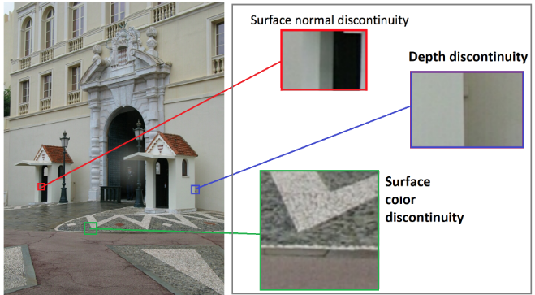

```{python}
#| echo: false
import cv2
import numpy as np
import os
import matplotlib.pyplot as plt
from IPython.display import Image
```

## Computer Vision Applications {.smaller}

Deep learning has dramatically expanded CV capabilities. Common applications:

1. **Optical Character Recognition** — license plates, handwritten documents.
2. **Surveillance and traffic monitoring** — detecting, tracking objects.
3. **Machine inspection** — defect detection on silicon wafers, PCBs.
4. **Object detection and classification** — YOLO, RCNN models.
5. **Pose estimation and face detection**.

*A computer has to perceive the world as we do — challenging even for humans
(optical illusions are a classic example).*

## Image Representation {.smaller}

Images are stored as **NumPy arrays**:

* **Colour** image: shape $(H \times W \times 3)$ — three channels.
* **Grayscale** image: shape $(H \times W)$ — one channel.

OpenCV uses **BGR** colour ordering (not RGB). Displaying with `matplotlib`
after `cv2.imread` will show reversed colours unless you convert.

```{python vis-read}
starry_night = cv2.imread('data/starry_night.jpg')
print(f"Shape: {starry_night.shape}")   # (H, W, 3) in BGR
```

## BGR vs RGB: Colour Reversal {.smaller}

```{python vis-bgr-rgb}
#| fig-align: center
#| out-width: 80%
sn_rgb = cv2.cvtColor(starry_night, cv2.COLOR_BGR2RGB)
fig, axes = plt.subplots(1, 2, figsize=(9, 3.5))
axes[0].imshow(starry_night); axes[0].set_title('BGR (reversed colours)')
axes[1].imshow(sn_rgb);       axes[1].set_title('RGB (correct colours)');
```

Always convert BGR → RGB before displaying with `matplotlib`.

## Image Transformations: Grayscale & Translate {.smaller}

```{python vis-gray-trans}
sn_grayscale = cv2.cvtColor(starry_night, cv2.COLOR_BGR2GRAY)

rows, cols = starry_night.shape[:2]
M = np.float32([[1, 0, 400], [0, 1, 100]])  # move 400 right, 100 down
sn_translate = cv2.warpAffine(starry_night, M, (cols, rows))
sn_translate_rgb = cv2.cvtColor(sn_translate, cv2.COLOR_BGR2RGB)
```

## Image Transformations: Rotate & Resize {.smaller}

```{python vis-rot-resize}
rotation_matrix = cv2.getRotationMatrix2D((0.5*cols, 0.5*rows), 30, 1)
sn_rotated_rgb = cv2.cvtColor(
    cv2.warpAffine(starry_night, rotation_matrix, (cols, rows)),
    cv2.COLOR_BGR2RGB)

sn_resized_rgb = cv2.cvtColor(
    cv2.resize(starry_night, None, fx=1.2, fy=1.2, interpolation=cv2.INTER_CUBIC),
    cv2.COLOR_BGR2RGB)
```

## All Four Transformations {.smaller}

```{python vis-transforms-plot}
#| fig-align: center
#| out-width: 90%
images = [sn_grayscale, sn_rotated_rgb, sn_translate_rgb, sn_resized_rgb]
titles = ['Grayscale', 'Rotated 30°', 'Translated', 'Resized 120%']
fig, axes = plt.subplots(2, 2, figsize=(9, 7))
for ax, img, title in zip(axes.flat, images, titles):
    ax.imshow(img, cmap='gray' if title == 'Grayscale' else None)
    ax.set_title(title)
plt.tight_layout()
```

## Working with Masks {.smaller}

A **mask** is a binary image identifying foreground (white = 255) and
background (black = 0). Used to:

* Isolate a region of interest for further processing.
* Apply operations only to selected pixels.

Workflow:

1. Convert to **HSV** (Hue–Saturation–Value) colourspace.
2. Define lower/upper HSV bounds for the target colour.
3. Call `cv2.inRange()` to generate the mask.

## Messi: Creating a Mask for the Ball {.smaller}

```{python vis-messi-mask}
#| fig-align: center
#| out-width: 55%
messi = cv2.imread('data/messi5.jpg')
hsv = cv2.cvtColor(messi, cv2.COLOR_BGR2HSV)
lower_yellow = np.array([21, 100, 100])
upper_yellow = np.array([41, 255, 255])
mask1 = cv2.inRange(hsv, lower_yellow, upper_yellow)
mask1[:, :330] = 0; mask1[:, 405:] = 0  # restrict to ball region
plt.imshow(mask1, cmap='gray'); plt.title('Ball mask');
```

## Messi: Drawing the Ball Outline {.smaller}

```{python vis-messi-hull}
#| fig-align: center
#| out-width: 55%
contours, _ = cv2.findContours(mask1, cv2.RETR_EXTERNAL, cv2.CHAIN_APPROX_SIMPLE)
largest_contour = max(contours, key=cv2.contourArea)
hull = cv2.convexHull(largest_contour)
messi_copy = messi.copy()
cv2.drawContours(messi_copy, [hull], -1, (0, 0, 255), thickness=2)
plt.imshow(cv2.cvtColor(messi_copy, cv2.COLOR_BGR2RGB));
```

## Perspective Transforms: Concept {.smaller}

A **perspective transform** maps four source points to four destination points,
distorting the image to change the viewpoint. Useful for:

* Straightening a tilted document (OCR pre-processing).
* Getting a top-down view of a field or board.

Uses: `cv2.getPerspectiveTransform(pts1, pts2)` then `cv2.warpPerspective`.

## Sudoku: Perspective Transform {.smaller}

```{python vis-sudoku}
#| fig-align: center
#| out-width: 85%
sudoku = cv2.imread('data/sudoku.png')
pts1 = np.float32([[73, 85], [350, 88], [355, 360], [48, 357]])
pts2 = np.float32([[0, 0], [300, 0], [300, 300], [0, 300]])
M_s = cv2.getPerspectiveTransform(pts1, pts2)
sudoku_dst = cv2.warpPerspective(sudoku, M_s, (300, 300))
plt.subplot(121); plt.imshow(cv2.cvtColor(sudoku, cv2.COLOR_BGR2RGB)); plt.title('Original')
plt.subplot(122); plt.imshow(cv2.cvtColor(sudoku_dst, cv2.COLOR_BGR2RGB)); plt.title('Straightened');
plt.tight_layout()
```

## Football: Top-Down View {.smaller}

```{python vis-football}
#| fig-align: center
#| out-width: 85%
football1 = cv2.imread('data/football1.png')
pts1 = np.float32([[45,121],[48,238],[206,230],[155,118]])
pts2 = np.float32([[45,100],[45,220],[77,220],[77,100]])
M_f = cv2.getPerspectiveTransform(pts1, pts2)
dst = cv2.warpPerspective(football1, M_f, (504, 360))
pts = np.array([[45,121],[48,238],[206,230],[155,119]], np.int32).reshape((-1,1,2))
cv2.polylines(football1, [pts], True, (255,0,0), 1)
fig = plt.figure(figsize=(9, 4)); gs = fig.add_gridspec(1, 2, width_ratios=[2,1])
fig.add_subplot(gs[0]).imshow(cv2.cvtColor(football1, cv2.COLOR_BGR2RGB))
fig.add_subplot(gs[1]).imshow(cv2.cvtColor(dst[:300,:200], cv2.COLOR_BGR2RGB));
```

## Edge Detection {.smaller}

{fig-align="center" width=70%}

An **edge** is a sharp change in pixel intensity — boundary of an object,
change in depth or illumination. All edge detectors rely on computing the
**gradient** of pixel values.

## Sobel Edge Detection {.smaller}

Detects edges in the **horizontal** and **vertical** directions independently.

```{python vis-sobel}
#| fig-align: center
#| out-width: 80%
dst_gray = cv2.cvtColor(sudoku_dst, cv2.COLOR_BGR2GRAY)
sobelx = cv2.Sobel(dst_gray, cv2.CV_64F, 1, 0, ksize=5)
sobely = cv2.Sobel(dst_gray, cv2.CV_64F, 0, 1, ksize=5)
plt.subplot(1,2,1); plt.imshow(sobelx, cmap='gray'); plt.title('Vertical edges')
plt.subplot(1,2,2); plt.imshow(sobely, cmap='gray'); plt.title('Horizontal edges');
```

## Canny Edge Detection {.smaller}

Multi-step approach: gradient computation → non-maximum suppression →
double thresholding → edge tracking by hysteresis.

* Identifies edges in **all directions**.
* Weak edges connected to strong edges are retained.

```{python vis-canny}
#| fig-align: center
#| out-width: 55%
messi_gray = cv2.cvtColor(messi, cv2.COLOR_BGR2GRAY)
messi_canny = cv2.Canny(messi_gray, 150, 200)
plt.imshow(messi_canny, cmap='gray');
```

## Hough Transform: Circle Detection {.smaller}

The **Hough transform** detects shapes of known parametric form.
For circles, it searches over $(x_c, y_c, r)$ parameter space.

```{python vis-hough}
blurred = cv2.GaussianBlur(messi_gray, (9, 9), 2)
circles = cv2.HoughCircles(blurred, cv2.HOUGH_GRADIENT, dp=1, minDist=50,
                           param1=50, param2=22, minRadius=18, maxRadius=38)
print(circles)
```

Three circles found — use domain knowledge to discard false positives.

## Hough: Drawing Detected Circles {.smaller}

```{python vis-circles-draw}
#| fig-align: center
#| out-width: 55%
circles_r = np.uint16(np.around(circles))
messi_circ = messi.copy()
for i, c in enumerate(circles_r[0, :]):
    cv2.circle(messi_circ, (c[0], c[1]), c[2], (0, 255, 0), 2)
    cv2.putText(messi_circ, str(i), (c[0], c[1]),
                cv2.FONT_HERSHEY_SIMPLEX, 0.6, (255, 255, 0), 2)
plt.imshow(cv2.cvtColor(messi_circ, cv2.COLOR_BGR2RGB));
```

## CV Tasks and Available Models {.smaller}

| Task | Example models |
|---|---|
| Object detection | YOLOv8, Faster-RCNN, SSD |
| Image classification | GoogLeNet, SqueezeNet |
| Semantic segmentation | ENet, FCN |
| Object tracking | VIT (Vision Transformer tracker) |
| Face detection | YuNet (from OpenCV Zoo) |
| Pose estimation | MediaPipe, OpenPose |

All high-performing models today are **deep learning** models.

## OpenCV Repository: Downloading Models {.smaller}

Three GitHub repositories needed:

1. `opencv` — sample scripts, configuration files, model download scripts.
2. `opencv_extra` — additional config for the models.
3. `opencv_zoo` — model weights for a curated set of models.

```
|-01-lecture.ipynb
|-opencv/
|-opencv_extra/
|-opencv_zoo/
```

Navigate to `opencv/samples/dnn/`, then run:

```{python vis-download}
#| eval: false
python download_models.py --save_dir GOOGLENET googlenet
```

## GoogLeNet Configuration {.smaller}

```{python vis-googlenet-cfg}
#| eval: false
# From models.yml in opencv/samples/dnn/
googlenet:
  model:   "bvlc_googlenet.caffemodel"
  config:  "bvlc_googlenet.prototxt"
  mean:    [104, 117, 123]
  scale:   1.0
  width:   224
  height:  224
  rgb:     false
  classes: "classification_classes_ILSVRC2012.txt"
```

Key parameters: model weights file, network config file, input normalisation
(`mean`, `scale`), input resolution, and class labels.

## Running GoogLeNet {.smaller}

```{python vis-googlenet-run}
#| eval: false
python classification.py \
  --model GOOGLENET/.../bvlc_googlenet.caffemodel \
  --config opencv_extra/.../bvlc_googlenet.prototxt \
  --width 224 --height 224 \
  --classes ../data/dnn/classification_classes_ILSVRC2012.txt \
  --mean 104 117 123 \
  --input data/cars.jpg
```

{fig-align="center" width=60%}

## OpenCV Model Zoo {.smaller}

The `opencv_zoo` directory contains ready-to-use model weights — no separate download needed.

```{python vis-zoo}
#| eval: false
# Navigate to opencv_zoo/models/face_detection_yunet/
# then run:
python demo.py
```

Available models in the zoo:

* `face_detection_yunet` — face detection.
* `object_detection_nanodet` — lightweight object detection.
* `image_classification_ppresnet` — image classification.
* `object_tracking_vittrack` — VIT-based object tracker.

## Summary {.smaller}

Key takeaways from the computer vision chapter:

* **Images** are NumPy arrays; beware of BGR vs. RGB in OpenCV.
* **Pre-processing** (transforms, masks, edge detection) is crucial before
  applying models — garbage in, garbage out.
* **Masks** + **contours** + **Hough transforms** can locate known-shape objects.
* **Perspective transforms** flatten tilted planes for easier downstream processing.
* Deep learning models via **OpenCV** or **opencv_zoo** can be run with just a
  few lines of Python.

Explore the opencv documentation for smoothing, thresholding, morphological
operations, and more — each is a valuable pre-processing step.
